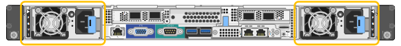
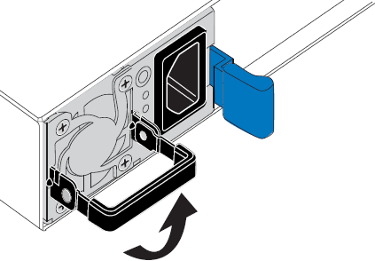
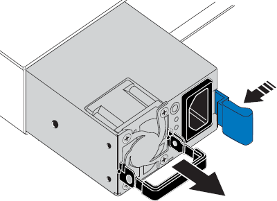
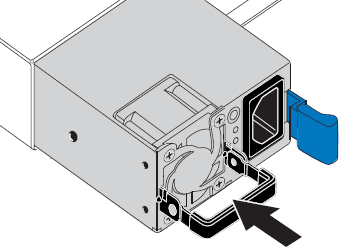

= Replacing a power supply in the services appliance
:icons: font
:imagesdir: ../media/

[.lead]
The services appliance has two power supplies for redundancy. If one of the power supplies fails, you must replace it as soon as possible to ensure that the appliance has redundant power.

.What you'll need

* You have unpacked the replacement power supply unit.
* You have physically located the appliance where you are replacing the power supply in the data center.
+
xref:locating-controller-in-data-center.adoc[Locating the controller in a data center]

* You can confirmed that the other power supply is installed and running.

.About this task

The figure shows the two power supply units for the SG100, which are accessible from the back of the appliance.

NOTE: The power supplies for the SG1000 are identical.

.Steps

. Unplug the power cord from the power supply.
. Lift the cam handle.
+

. Press the blue latch and pull the power supply out.
+

. Slide the replacement power supply into the chassis.
+
Ensure that the blue latch is on the right side when you slide the unit in.
+

. Push the cam handle down to secure the power supply.
. Attach the power cord to the power supply, and ensure that the green LED comes on.
