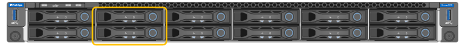
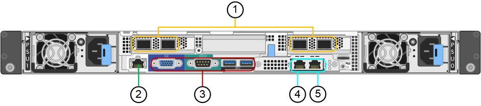
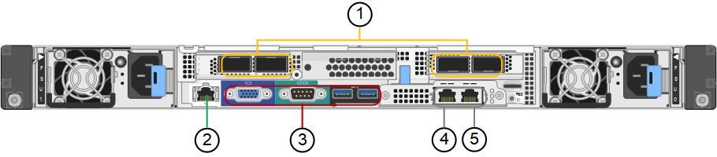

= SG100 and SG1000 appliances overview
:icons: font
:imagesdir: ../media/

[.lead]
The StorageGRID SG100 services appliance and the SG1000 services appliance can operate as a Gateway Node and as an Admin Node to provide high availability load balancing services in a StorageGRID system. Both appliances can operate as Gateway Nodes and Admin Nodes (primary or non-primary) at the same time.

== Appliance features

Both models of the services appliance provide the following features:

* Gateway Node or Admin Node functions for a StorageGRID system.
* The StorageGRID Appliance Installer to simplify node deployment and configuration.
* When deployed, can access StorageGRID software from an existing Admin Node or from software downloaded to a local drive. To further simplify the deployment process, a recent version of the software is preloaded onto the appliance during manufacturing.
* A baseboard management controller (BMC) for monitoring and diagnosing some of the appliance hardware.
* The ability to connect to all three StorageGRID networks, including the Grid Network, the Admin Network, and the Client Network:
 ** The SG100 supports up to four 10- or 25-GbE connections to the Grid Network and Client Network.
 ** The SG1000 supports up to four 10-, 25-, 40-, or 100-GbE connections to the Grid Network and Client Network.

== SG100 and SG1000 diagrams

This figure shows the front of the SG100 and the SG1000 with the bezel removed.

NOTE: From the front, the two appliances are identical except for the product name on the bezel.

The two solid-state drives (SSDs), indicated by the orange outline, are used for storing the StorageGRID operating system and are mirrored using RAID1 for redundancy. When the SG100 or SG1000 services appliance is configured as an Admin Node, these drives are used to store audit logs, metrics, and database tables.

The remaining drive slots are blank.

== Connectors on the rear of the SG100

This figure shows the connectors on the back of the SG100.

[options="header"]
|===
|  | Port| Type| Use
a|
1
a|
Network ports 1-4
a|
10/25-GbE, based on cable or SFP transceiver type (SFP28 and SFP+ modules are supported), switch speed, and configured link speed
a|
Connect to the Grid Network and the Client Network for StorageGRID.
a|
2
a|
BMC management port
a|
1-GbE (RJ-45)
a|
Connect to the appliance baseboard management controller.
a|
3
a|
Diagnostic and support ports
a|

* VGA
* Serial, 115200 8-N-1
* USB

a|
Reserved for technical support use.
a|
4
a|
Admin Network port 1
a|
1-GbE (RJ-45)
a|
Connect the appliance to the Admin Network for StorageGRID.
a|
5
a|
Admin Network port 2
a|
1-GbE (RJ-45)
a|
Options:

* Bond with management port 1 for a redundant connection to the Admin Network for StorageGRID.
* Leave disconnected and available for temporary local access (IP 169.254.0.1).
* During installation, use port 2 for IP configuration if DHCP-assigned IP addresses are not available.

|===

== Connectors on the rear of the SG1000

This figure shows the connectors on the back of the SG1000.

[options="header"]
|===
|  | Port| Type| Use
a|
1
a|
Network ports 1-4
a|
10/25/40/100-GbE, based on cable or transceiver type, switch speed, and configured link speed. QSFP28 and QSFP+ (40/100GbE) are supported natively and SFP28/SFP+ transceivers can be used with a QSA (sold separately) to use 10/25GbE speeds.
a|
Connect to the Grid Network and the Client Network for StorageGRID.
a|
2
a|
BMC management port
a|
1-GbE (RJ-45)
a|
Connect to the appliance baseboard management controller.
a|
3
a|
Diagnostic and support ports
a|

* VGA
* Serial, 115200 8-N-1
* USB

a|
Reserved for technical support use.
a|
4
a|
Admin Network port 1
a|
1-GbE (RJ-45)
a|
Connect the appliance to the Admin Network for StorageGRID.
a|
5
a|
Admin Network port 2
a|
1-GbE (RJ-45)
a|
Options:

* Bond with management port 1 for a redundant connection to the Admin Network for StorageGRID.
* Leave disconnected and available for temporary local access (IP 169.254.0.1).
* During installation, use port 2 for IP configuration if DHCP-assigned IP addresses are not available.

|===
