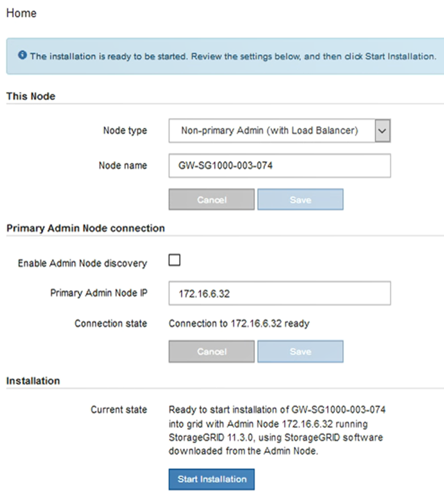

= Deploying a services appliance as a Gateway or non-primary Admin Node
:icons: font
:imagesdir: ../media/

[.lead]
When you deploy a services appliance as a Gateway Node or non-primary Admin Node, you use the StorageGRID Appliance Installer included on the appliance.

* The appliance has been installed in a rack or cabinet, connected to your networks, and powered on.
* Network links, IP addresses, and port remapping (if necessary) have been configured for the appliance using the StorageGRID Appliance Installer.
+
IMPORTANT: If you have remapped any ports, you cannot use the same ports to configure load balancer endpoints. You can create endpoints using remapped ports, but those endpoints will be remapped to the original CLB ports and service, not the Load Balancer service. Follow the steps in the recovery and maintenance instructions for removing port remaps.
+
NOTE: The CLB service is deprecated.

* The primary Admin Node for the StorageGRID system has been deployed.
* All Grid Network subnets listed on the IP Configuration page of the StorageGRID Appliance Installer have been defined in the Grid Network Subnet List on the primary Admin Node.
* You have a service laptop with a supported web browser.
* You know the IP address assigned to the appliance. You can use the IP address for any attached StorageGRID network.

To install StorageGRID on a services appliance node:

* You specify or confirm the IP address of the primary Admin Node and the name of the appliance node.
* You start the installation and wait as the software is installed.
+
Partway through the appliance Gateway Node installation tasks, the installation pauses. To resume the installation, you sign into the Grid Manager, approve all grid nodes, and complete the StorageGRID installation process. The installation of a non-primary Admin Node does not require your approval.

IMPORTANT: Do not deploy the SG100 and SG1000 service appliances in the same site. Unpredictable performance might result.

NOTE: If you need to deploy multiple appliance nodes at one time, you can automate the installation process by using the configure-sga.py Appliance Installation script. You can also use the Appliance Installer to upload a JSON file that contains configuration information.

xref:task_automating_appliance_installation_and_configuration.adoc[Automating appliance installation and configuration]

. Open a browser, and enter the IP address for the appliance.
+
`+https://Controller_IP:8443+`
+
The StorageGRID Appliance Installer Home page appears.

. In the Primary Admin Node connection section, determine whether you need to specify the IP address for the primary Admin Node.
+
If you have previously installed other nodes in this data center, the StorageGRID Appliance Installer can discover this IP address automatically, assuming the primary Admin Node, or at least one other grid node with ADMIN_IP configured, is present on the same subnet.

. If this IP address is not shown or you need to change it, specify the address:
+
|===
| Option| Description
a|
Manual IP entry
a|

 .. Unselect the *Enable Admin Node discovery* check box.
 .. Enter the IP address manually.
 .. Click *Save*.
 .. Wait for the connection state for the new IP address to become ready.

a|
Automatic discovery of all connected primary Admin Nodes
a|

 .. Select the *Enable Admin Node discovery* check box.
 .. Wait for the list of discovered IP addresses to be displayed.
 .. Select the primary Admin Node for the grid where this appliance Storage Node will be deployed.
 .. Click *Save*.
 .. Wait for the connection state for the new IP address to become ready.

+
|===

. In the *Node name* field, enter the name you want to use for this appliance node, and click *Save*.
+
The node name is assigned to this appliance node in the StorageGRID system. It is shown on the Nodes page (Overview tab) in the Grid Manager. If required, you can change the name when you approve the node.

. Optionally, to install a different version of the StorageGRID software, follow these steps:
 .. Download the installation archive from the NetApp Downloads page for StorageGRID.
+
https://mysupport.netapp.com/site/products/all/details/storagegrid/downloads-tab[NetApp Downloads: StorageGRID]

 .. Extract the archive.
 .. From the StorageGRID Appliance Installer, select *Advanced* > *Upload StorageGRID Software*.
 .. Click *Remove* to remove the current software package.

     

 .. Click *Browse* for the software package you downloaded and extracted, and then click *Browse* for the checksum file.

     

 .. Select *Home* to return to the Home page.
. In the Installation section, confirm that the current state is "`Ready to start installation of node name into grid with primary Admin Node admin_ip`" and that the *Start Installation* button is enabled.
+
If the *Start Installation* button is not enabled, you might need to change the network configuration or port settings. For instructions, see the installation and maintenance instructions for your appliance.

. From the StorageGRID Appliance Installer home page, click *Start Installation*.
+

+
The Current state changes to "`Installation is in progress,`" and the Monitor Installation page is displayed.
+
NOTE: If you need to access the Monitor Installation page manually, click *Monitor Installation* from the menu bar.

. If your grid includes multiple appliance nodes, repeat the previous steps for each appliance.

*Related information*

xref:task_deploying_a_services_appliance_as_a_primary_admin_node.adoc[Deploying a services appliance as a primary Admin Node]
