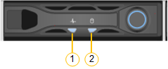

= Viewing status indicators on the SG100 and SG1000 appliances
:icons: font
:imagesdir: ../media/

[.lead]
The appliance includes indicators that help you determine the status of the appliance controller and the two SSDs.

== Appliance indicators and buttons

image::../media/sg6000_cn_front_indicators.gif[Front Indicators - SG1000]

[options="header"]
|===
|  | Display| State
a|
1
a|
Power button
a|

* Blue: the appliance is powered on.
* Off: the appliance is powered off.

a|
2
a|
Reset button
a|
Use this button to perform a hard reset of the controller.
a|
3
a|
Identify button
a|
This button can be set to Blink, On (Solid), or Off.

* Blue, blinking: Identifies the appliance in the cabinet or rack.
* Blue, solid: Identifies the appliance in the cabinet or rack.
* Off: The appliance is not visually identifiable in the cabinet or rack.

a|
4
a|
Alarm LED
a|

* Amber, solid: An error has occurred.
+
*Note:* To view the boot-up and error codes, you must access the BMC interface.

* Off: No errors are present.

|===

== General boot-up codes

During boot-up or after a hard reset of the appliance, the following occurs:

. The baseboard management controller (BMC) logs codes for the boot-up sequence, including any errors that occur.
. The power button lights up.
. If any errors occur during boot-up, the alarm LED lights up.
+
To view the boot-up and error codes, you must access the BMC interface.

== SSD indicators

[options="header"]
|===
| LED| Display| State
a|
1
a|
Drive status/fault
a|

* Blue (solid): drive is online
* Amber (blinking): drive failure
* Off: slot is empty

a|
2
a|
Drive active
a|
Blue (blinking): drive is being accessed
|===
.Related information

xref:troubleshooting-hardware-installation-sg100-and-sg1000.adoc[Troubleshooting the hardware installation]

xref:configuring-bmc-interface-sg1000.adoc[Configuring the BMC interface]
