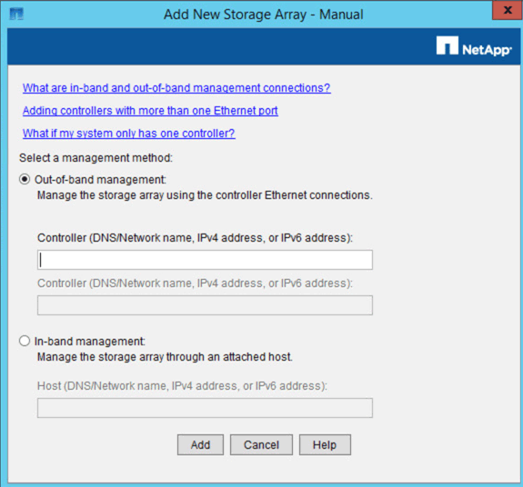

= Adding the appliance to SANtricity Storage Manager
:icons: font
:imagesdir: ../media/

[.lead]
You connect the E2700 controller in the appliance to SANtricity Storage Manager and then add the appliance as a storage array.

.What you'll need

You are using a supported web browser.

.About this task

For detailed instructions, see the SANtricity Storage Manager documentation.

.Steps

. Open a web browser, and enter the IP address as the URL for SANtricity Storage Manager: +
`https://_E2700_Controller_IP_`
+
The login page for SANtricity Storage Manager appears.

. On the Select Addition Method page, select *Manual*, and click *OK*.
. Select *Edit* > *Add Storage Array*.
+
The Add New Storage Array - Manual page appears.
+

. In the *Out-of-band management* box, enter one of the following values:
 ** *Using DHCP:* The IP address assigned by the DHCP server to management port 1 on the E2700 controller
 ** *Not using DHCP:* 192.168.128.101
+
NOTE:  Only one of the appliance's controllers is connected to SANtricity Storage Manager, so you only need to enter one IP address.
. Click *Add*.

.Related information

http://mysupport.netapp.com/documentation/productlibrary/index.html?productID=61197[NetApp Documentation: SANtricity Storage Manager]
