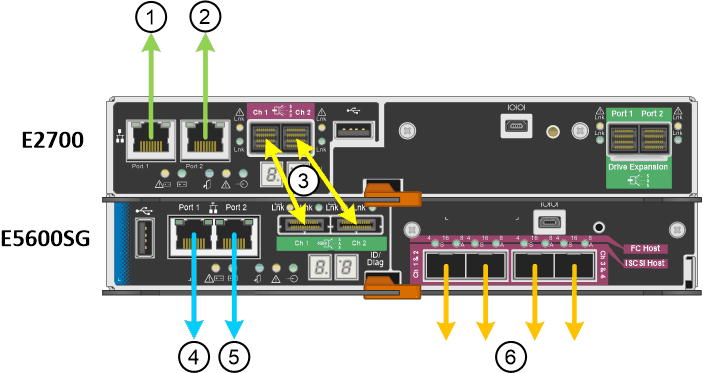

= Cabling the appliance (SG5600)
:icons: font
:imagesdir: ../media/

[.lead]
You must connect the two controllers to each other with SAS interconnect cables, connect the management ports to the appropriate management network, and connect the 10 GbE ports on the E5600SG controller to the Grid Network and optional Client Network for StorageGRID.

.What you'll need

* You have Ethernet cables for connecting the management ports.
* You have optical cables for connecting the four 10-GbE ports (these are not provided with the appliance).

CAUTION: *Risk of exposure to laser radiation* -- Do not disassemble or remove any part of an SFP transceiver. You might be exposed to laser radiation.

.About this task

When connecting the cables, refer to the following diagram, which shows the E2700 controller on the top and the E5600SG controller on the bottom. The diagram shows the SG5660 model; the controllers in the SG5612 model are side by side instead of stacked.

[options="header"]
|===
| Item| Port| Type of port| Function
a|
1
a|
Management port 1 on the E2700 controller
a|
1-Gb (RJ-45) Ethernet
a|
Connects the E2700 controller to the network where SANtricity Storage Manager is installed.
a|
2
a|
Management port 2 on the E2700 controller
a|
1-Gb (RJ-45) Ethernet
a|
Connects the E2700 controller to a service laptop during installation.
a|
3
a|
Two SAS interconnect ports on each controller, labelled Ch 1 and Ch 2
a|
E2700 controller: mini-SAS-HD

E5600SG controller: mini-SAS

a|
Connect the two controllers to each other.
a|
4
a|
Management port 1 on the E5600SG controller
a|
1-Gb (RJ-45) Ethernet
a|
Connects the E5600SG controller to the Admin Network for StorageGRID.
a|
5
a|
Management port 2 on the E5600SG controller
a|
1-Gb (RJ-45) Ethernet
a|

* Can be bonded with management port 1 if you want a redundant connection to the Admin Network.
* Can be left unwired and available for temporary local access (IP 169.254.0.1).
* Can be used to connect the E5600SG controller to a service laptop during installation if DHCP-assigned IP addresses are not available.

a|
6
a|
Four network ports on the E5600SG controller
a|
10-GbE (optical)
a|
Connect the E5600SG controller to the Grid Network and to the Client Network (if used) for StorageGRID. The ports can be bonded together to provide redundant paths to the controller.
|===

.Steps

. Connect the E2700 controller to the E5600SG controller, using the two SAS interconnect cables.
+
[options="header"]
|===
| Connect this port...| To this port...
a|
SAS interconnect port 1 (labeled Ch 1) on the E2700 controller
a|
SAS interconnect port 1 (labeled Ch 1) on the E5600SG controller
a|
SAS interconnect port 2 (labeled Ch 2) on the E2700 controller
a|
SAS interconnect port 2 (labeled Ch 2) on the E5600SG controller
|===
Use the square connector (mini-SAS HD) for the E2700 controller, and use the rectangular connector (mini-SAS) for the E5600SG controller.
+
IMPORTANT: Make sure the pull tabs on the SAS connectors are at the bottom, and carefully insert each connector until it clicks into place. Do not push on the connector if there is any resistance. Verify the position of the pull tab before continuing.

. Connect the E2700 controller to the management network where SANtricity Storage Manager software is installed, using an Ethernet cable.
+
[options="header"]
|===
| Connect this port...| To this port...
a|
Port 1 on the E2700 controller (the RJ-45 port on the left)
a|
Switch port on the management network used for SANtricity Storage Manager
a|
Port 2 on the E2700 controller
a|
Service laptop, if not using DHCP
|===

. If you plan to use the Admin Network for StorageGRID, connect the E5600SG controller, using an Ethernet cable.
+
[options="header"]
|===
| Connect this port...| To this port...
a|
Port 1 on the E5600SG controller (the RJ-45 port on the left)
a|
Switch port on the Admin Network for StorageGRID
a|
Port 2 on the E5600SG controller
a|
Service laptop, if not using DHCP
|===

. Connect the 10-GbE ports on the E5600SG controller to the appropriate network switches, using optical cables and SFP+ transceivers.
 ** If you plan to use Fixed port bond mode (default), connect the ports to the StorageGRID Grid and Client Networks, as shown in the table.
+
[options="header"]
|===
| Port| Connects to...
a|
Port 1
a|
Client Network (optional)
a|
Port 2
a|
Grid Network
a|
Port 3
a|
Client Network (optional)
a|
Port 4
a|
Grid Network
|===

 ** If you plan to use the Aggregate port bond mode, connect one or more of the network ports to one or more switches. You should connect at least two of the four ports to avoid having a single point of failure. If you use more than one switch for a single LACP bond, the switches must support MLAG or equivalent.

.Related information

xref:port-bond-modes-for-e5600sg-controller-ports.adoc[Port bond modes for the E5600SG controller ports]

xref:accessing-storagegrid-appliance-installer-sg5600.adoc[Accessing the StorageGRID Appliance Installer]
