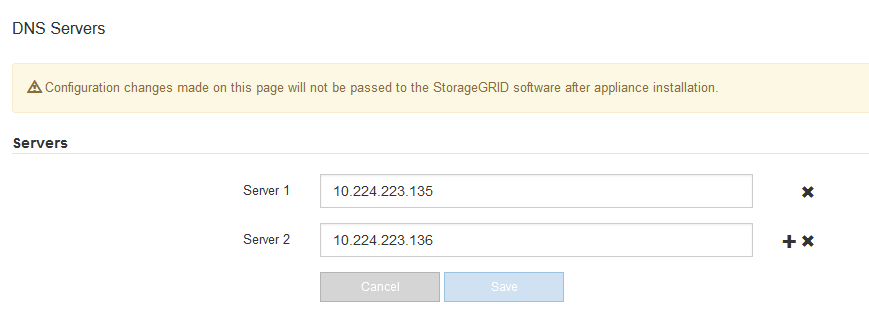

= Checking the DNS server configuration
:icons: font
:imagesdir: ../media/

[.lead]
You can check and temporarily change the domain name system (DNS) servers that are currently in use by this appliance node.

.What you'll need

The appliance has been placed maintenance mode.

xref:placing-appliance-into-maintenance-mode.adoc[Placing an appliance into maintenance mode]

.About this task

You might need to change the DNS server settings if an encrypted appliance cannot connect to the key management server (KMS) or KMS cluster because the hostname for the KMS was specified as a domain name instead of an IP address. Any changes that you make to the DNS settings for the appliance are temporary and are lost when you exit maintenance mode. To make these changes permanent, specify the DNS servers in Grid Manager (*Maintenance* > *Network* > *DNS Servers*).

* Temporary changes to the DNS configuration are necessary only for node-encrypted appliances where the KMS server is defined using a fully qualified domain name, instead of an IP address, for the hostname.
* When a node-encrypted appliance connects to a KMS using a domain name, it must connect to one of the DNS servers defined for the grid. One of these DNS servers then translates the domain name into an IP address.
* If the node cannot reach a DNS server for the grid, or if you changed the grid-wide DNS settings when a node-encrypted appliance node was offline, the node is unable to connect to the KMS. Encrypted data on the appliance cannot be decrypted until the DNS issue is resolved.

To resolve a DNS issue preventing KMS connection, specify the IP address of one or more DNS servers in the StorageGRID Appliance Installer. These temporary DNS settings allow the appliance to connect to the KMS and decrypt data on the node.

For example, if the DNS server for the grid changes while an encrypted node was offline, the node will not be able to reach the KMS when it comes back online, since it is still using the previous DNS values. Entering the new DNS server IP address in the StorageGRID Appliance Installer allows a temporary KMS connection to decrypt the node data.

.Steps

. From the StorageGRID Appliance Installer, select *Configure Networking* > *DNS Configuration*.
. Verify that the DNS servers specified are correct.
+

. If required, change the DNS servers.
+
IMPORTANT: Changes made to the DNS settings are temporary and are lost when you exit maintenance mode.

. When you are satisfied with the temporary DNS settings, select *Save*.
+
The node uses the DNS server settings specified on this page to reconnect to the KMS, allowing data on the node to be decrypted.

. After node data is decrypted, reboot the node. From the StorageGRID Appliance Installer, select *Advanced* > *Reboot Controller*, and then select one of these options:
 ** Select *Reboot into StorageGRID* to reboot the controller with the node rejoining the grid. Select this option if you are done working in maintenance mode and are ready to return the node to normal operation.
 ** Select *Reboot into Maintenance Mode* to reboot the controller with the node remaining in maintenance mode. Select this option if there are additional maintenance operations you need to perform on the node before rejoining the grid.
image:../media/reboot_controller_from_maintenance_mode.png[Reboot controller in maintenance mode]
+
NOTE: When the node reboots and rejoins the grid, it uses the system-wide DNS servers listed in the Grid Manager. After rejoining the grid, the appliance will no longer use the temporary DNS servers specified in the StorageGRID Appliance Installer while the appliance was in maintenance mode.
+
It can take up to 20 minutes for the appliance to reboot and rejoin the grid. To confirm that the reboot is complete and that the node has rejoined the grid, go back to the Grid Manager. The *Nodes* tab should display a normal status image:../media/icon_alert_green_checkmark.png[icon alert green checkmark] for the appliance node, indicating that no alerts are active and the node is connected to the grid.
+
image::../media/node_rejoin_grid_confirmation.png[Appliance node rejoined grid]
