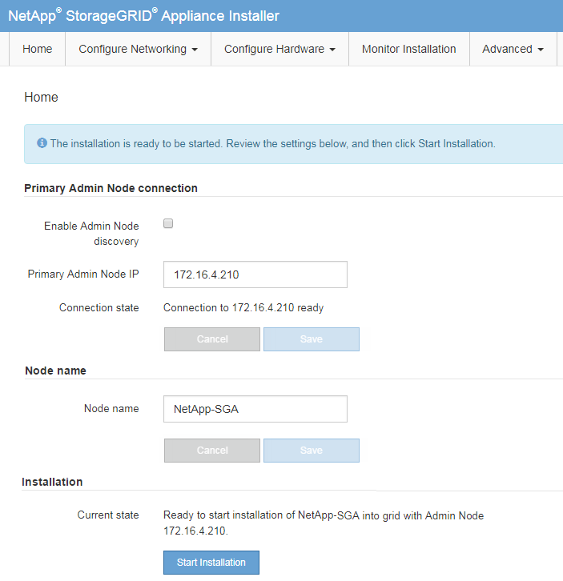

= Deploying an appliance Storage Node
:icons: font
:imagesdir: ../media/

[.lead]
After installing and configuring the storage appliance, you can deploy it as a Storage Node in a StorageGRID system. When you deploy an appliance as a Storage Node, you use the StorageGRID Appliance Installer included on the appliance.

.What you'll need

* If you are cloning an appliance node, continue following the process in recovery and maintenance.
+
xref:../maintain/index.adoc[Maintain & recover]

* The appliance has been installed in a rack or cabinet, connected to your networks, and powered on.
* Network links, IP addresses, and port remapping (if necessary) have been configured for the appliance using the StorageGRID Appliance Installer.
* You know one of the IP addresses assigned to the appliance's compute controller. You can use the IP address for any attached StorageGRID network.
* The primary Admin Node for the StorageGRID system has been deployed.
* All Grid Network subnets listed on the IP Configuration page of the StorageGRID Appliance Installer have been defined in the Grid Network Subnet List on the primary Admin Node.
* You have a service laptop with a supported web browser.

.About this task

Each storage appliance functions as a single Storage Node. Any appliance can connect to the Grid Network, the Admin Network, and the Client Network

To deploy an appliance Storage Node in a StorageGRID system, you access the StorageGRID Appliance Installer and perform the following steps:

* You specify or confirm the IP address of the primary Admin Node and the name of the Storage Node.
* You start the deployment and wait as volumes are configured and the software is installed.
* When the installation pauses partway through the appliance installation tasks, you resume the installation by signing into the Grid Manager, approving all grid nodes, and completing the StorageGRID installation and deployment processes.

NOTE: If you need to deploy multiple appliance nodes at one time, you can automate the installation process by using the `configure-sga.py` Appliance Installation script.

* If you are performing an expansion or recovery operation, follow the appropriate instructions:

** To add an appliance Storage Node to an existing StorageGRID system, see the instructions for expanding a StorageGRID system.
** To deploy an appliance Storage Node as part of a recovery operation, see instructions for recovery and maintenance.

.Steps

. Open a browser, and enter one of the IP addresses for the appliance's compute controller. +
`*https://_Controller_IP_:8443*`
+
The StorageGRID Appliance Installer Home page appears.
+

. In the *Primary Admin Node* connection section, determine whether you need to specify the IP address for the primary Admin Node.
+
If you have previously installed other nodes in this data center, the StorageGRID Appliance Installer can discover this IP address automatically, assuming the primary Admin Node, or at least one other grid node with ADMIN_IP configured, is present on the same subnet.

. If this IP address is not shown or you need to change it, specify the address:
+
[options="header"]
|===
| Option| Description
a|
Manual IP entry
a|

 .. Unselect the *Enable Admin Node discovery* check box.
 .. Enter the IP address manually.
 .. Click *Save*.
 .. Wait for the connection state for the new IP address to become ready.

a|
Automatic discovery of all connected primary Admin Nodes
a|

 .. Select the *Enable Admin Node discovery* check box.
 .. Wait for the list of discovered IP addresses to be displayed.
 .. Select the primary Admin Node for the grid where this appliance Storage Node will be deployed.
 .. Click *Save*.
 .. Wait for the connection state for the new IP address to become ready.
|===

. In the *Node name* field, enter the name you want to use for this appliance node, and click *Save*.
+
The node name is assigned to this appliance node in the StorageGRID system. It is shown on the Nodes page (Overview tab) in the Grid Manager. If required, you can change the name when you approve the node.

. In the Installation section, confirm that the current state is "Ready to start installation of `_node name_` into grid with primary Admin Node `_admin_ip_` " and that the *Start Installation* button is enabled.
+
If the *Start Installation* button is not enabled, you might need to change the network configuration or port settings. For instructions, see the installation and maintenance instructions for your appliance.
+
NOTE: If you are deploying the Storage Node appliance as a node cloning target, stop the deployment process here and continue the node cloning procedure in recovery and maintenance.
+
xref:../maintain/index.adoc[Maintain & recover]

. From the StorageGRID Appliance Installer home page, click *Start Installation*.
+
The Current state changes to "`Installation is in progress,`" and the Monitor Installation page is displayed.
+
NOTE: If you need to access the Monitor Installation page manually, click *Monitor Installation*.

. If your grid includes multiple appliance Storage Nodes, repeat these steps for each appliance.
+
NOTE: If you need to deploy multiple appliance Storage Nodes at one time, you can automate the installation process by using the `configure-sga.py` appliance installation script. This script applies only to Storage Nodes.

.Related information

xref:../expand/index.adoc[Expand your grid]

xref:../maintain/index.adoc[Maintain & recover]
