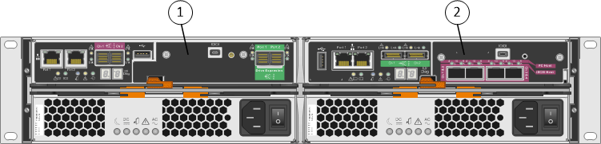
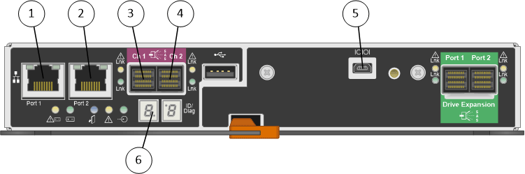
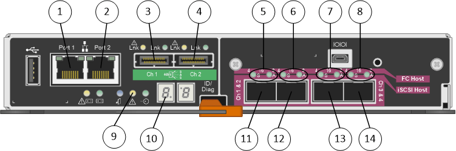

= Hardware diagrams
:icons: font
:imagesdir: ../media/

[.lead]
The SG5612 and SG5660 models of the StorageGRID appliance both include an E2700 controller and an E5600SG controller. You should review the diagrams to learn the differences between the models and the controllers.

== Model SG5612 2U: Rear view of the E2700 controller and E5600SG controller

[options="header"]
|===
| Callout| Description
a|
1
a|
E2700 controller
a|
2
a|
E5600SG controller
|===

== Model SG5660 4U: Rear view of the E2700 controller and E5600SG controller

The E2700 controller is above the E5600SG controller.

image::../media/sg5660_4u_rear_view.gif[Back view of SG5660 with two controllers]

[options="header"]
|===
| Callout| Description
a|
1
a|
E2700 controller
a|
2
a|
E5600SG controller
|===

== Rear view of the E2700 controller

[options="header"]
|===
| Callout| Description
a|
1
a|
Management port 1 (Connect to the network where SANtricity Storage Manager is installed.)
a|
2
a|
Management port 2 (Use during installation to connect to a laptop.)
a|
3
a|
SAS interconnect port 1
a|
4
a|
SAS interconnect port 2
a|
5
a|
Serial connection port
a|
6
a|
Seven-segment display
|===

NOTE: The two SAS ports labeled Drive Expansion (green) on the rear of the E2700 controller are not used. The StorageGRID appliance does not support expansion drive shelves.

== Rear view of the E5600SG controller

[options="header"]
|===
| Callout| Description
a|
1
a|
Management port 1Connect to the Admin network for StorageGRID.

a|
2
a|
Management port 2 Options:

* Bond with management port 1 for a redundant connection to the Admin Network for StorageGRID.
* Leave unwired and available for temporary local access (IP 169.254.0.1).
* During installation, use for IP configuration if DHCP-assigned IP addresses are not available.

a|
3
a|
SAS interconnect port 1
a|
4
a|
SAS interconnect port 2
a|
5
a|
Fault and Active LEDs for 10-GbE network port 1
a|
6
a|
Fault and Active LEDs for 10-GbE network port 2
a|
7
a|
Fault and Active LEDs for 10-GbE network port 3
a|
8
a|
Fault and Active LEDs for 10-GbE network port 4
a|
9
a|
Needs Attention LED
a|
10
a|
Seven-segment display
a|
11
a|
10-GbE network port 1
a|
12
a|
10-GbE network port 2
a|
13
a|
10-GbE network port 3
a|
14
a|
10-GbE network port 4
|===

NOTE: The host interface card (HIC) on the StorageGRID appliance E5600SG controller supports only 10-Gb Ethernet connections. It cannot be used for iSCSI connections.
