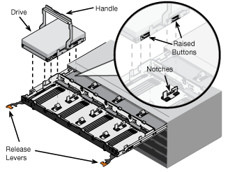

= Installing the appliance in a cabinet or rack (SG5600)
:icons: font
:imagesdir: ../media/

[.lead]
You must install rails in your cabinet or rack and then slide the appliance onto the rails. If you have an SG5660, you must also install the drives after installing the appliance.

.What you'll need

* You have reviewed the Safety Notices document included in the box, and understand the precautions for moving and installing hardware.
* You have the E-Series installation instructions for the hardware.

CAUTION: Install hardware from the bottom of the rack or cabinet or rack up to prevent the equipment from tipping over.

CAUTION: The SG5612 weighs approximately 60 lb (27 kg) when fully loaded with drives. Two people or a mechanized lift are required to safely move the SG5612.

CAUTION: The SG5660 weighs approximately 132 lb (60 kg) with no drives installed. Four people or a mechanized lift are required to safely move an empty SG5660.

CAUTION: To avoid damaging the hardware, never move an SG5660 if drives are installed. You must remove all drives before moving the appliance.

.About this task

Complete the following tasks to install the SG5660 appliance in a cabinet or rack.

* *Install the mounting rails*
+
Install the mounting rails in the cabinet or rack.
+
See the E-Series installation instructions for the E2700 or the E5600.

* *Install the appliance in the cabinet or rack*
+
Slide the appliance into the cabinet or rack, and secure it.
+
NOTE: If you are lifting the SG5660 by hand, attach the four handles to the sides of the chassis. You remove these handles as you slide the appliance onto the rails.

* *Install the drives*
+
If you have an SG5660, install 12 drives in each of the 5 drive drawers.
+
You must install all 60 drives to ensure correct operation.

 .. Put on the ESD wristband, and remove the drives from their packaging.
 .. Release the levers on the top drive drawer, and slide the drawer out using the levers.
 .. Raise the drive handle to vertical, and align the buttons on the drive with the notches on the drawer.
+

 .. Pressing gently on the top of the drive, rotate the drive handle down until the drive snaps into place.
 .. After installing the first 12 drives, slide the drawer back in by pushing on the center and closing both levers gently.
 .. Repeat these steps for the other four drawers.

* *Attach the front bezel*
+
*SG5612*: Attach the left and right end caps to the front.
+
*SG5660*: Attach the bezel to the front.

.Related information

https://library.netapp.com/ecm/ecm_download_file/ECMLP2344477[E2700 Controller-Drive Tray and Related Drive Trays Installation Guide^]

https://library.netapp.com/ecm/ecm_download_file/ECMP1532527[E5600 Controller-Drive Tray and Related Drive Trays Installation Guide^]
