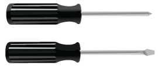
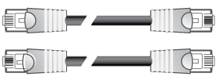
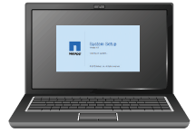

= Obtaining additional equipment and tools (SG5600)
:icons: font
:imagesdir: ../media/

[.lead]
Before installing the SG5600 appliance, confirm you have all of the additional equipment and tools that you need.

* *Screwdrivers*
+

+
Phillips No. 2 screwdriver
+
Medium flat-blade screwdrivers

* *ESD wrist strap*
+
image::../media/appliance_wriststrap.gif[ESD wrist strap]

* *Ethernet cables*
+

* *Ethernet switch*
+

* *Service laptop*
+

