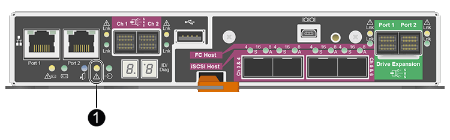
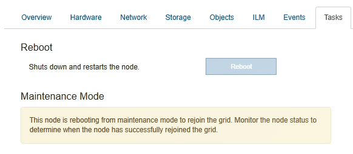

= Replacing the E2700 controller
:icons: font
:imagesdir: ../media/

[.lead]
You might need to replace the E2700 controller if it is not functioning optimally or it has failed.

.What you'll need

* You have a replacement controller with the same part number as the controller you are replacing.
* You have labels to identify each cable that is connected to the controller.
* You have antistatic protection.
* You must have the Maintenance or Root Access permission. For details, see the instructions for administering StorageGRID.

.About this task

You can determine if you have a failed controller by checking the amber Service Action Required LED on the controller (shown as 1 in the illustration). If this LED is on, the controller should be replaced.

The appliance Storage Node will not be accessible when you replace the controller. If the E2700 controller is functioning sufficiently, you can place the E5600SG controller into maintenance mode.

When you replace a controller, you must remove the battery from the original controller and install it in the replacement controller.

.Steps

. Prepare to remove the controller.
+
You use SANtricity Storage Manager to perform these steps.

 .. Make a note of which version of SANtricity OS software is currently installed on the controller.
 .. Make a note of which version of NVSRAM is currently installed.
 .. If the Drive Security feature is enabled, be sure a saved key exists and that you know the pass phrase required to install it.
+
IMPORTANT: *Possible loss of data access --* If all drives in the appliance are security enabled, the new controller will not be able to access the appliance until you unlock the secured drives using the Enterprise Management Window in SANtricity Storage Manager.

 .. Back up the configuration database.
+
If a problem occurs when you remove a controller, you can use the saved file to restore your configuration.

 .. Collect support data for the appliance.
+
NOTE: Collecting support data before and after replacing a component ensures you can send a full set of logs to technical support in case the replacement does not resolve the problem.

. If the StorageGRID appliance is running in a StorageGRID system, place the E5600SG controller into maintenance mode.
+
xref:placing-appliance-into-maintenance-mode.adoc[Placing an appliance into maintenance mode]

. If the E2700 controller is functioning sufficiently to allow for a controlled shutdown, confirm that all operations have completed.
 .. From the title bar of the Array Management Window, select *Monitor* > *Reports* > *Operations in Progress*.
 .. Confirm that all operations have completed.
. Follow the instructions in the replacement procedure for a simplex E2700 controller to complete these steps:
 .. Label the cables and then disconnect the cables.
+
IMPORTANT: To prevent degraded performance, do not twist, fold, pinch, or step on the cables.

 .. Remove the failed controller from the appliance.
 .. Remove the controller cover.
 .. Unscrew the thumbscrew and remove the battery from the failed controller.
 .. Install the battery in the replacement controller, and replace the controller cover.
 .. Install the replacement controller into the appliance.
 .. Replace the cables.
 .. Wait for the E2700 controller to reboot. Verify that the seven-segment display shows a state of `99`.
. If the appliance uses secured drives, import the drive security key.
. Return the appliance to normal operating mode. From the StorageGRID Appliance Installer, select *Advanced* > *Reboot Controller*, and then select *Reboot into StorageGRID*.
+
image::../media/reboot_controller_from_maintenance_mode.png[Reboot controller in maintenance mode]
+
During the reboot, the following screen appears:
+

+
The appliance reboots and rejoins the grid. This process can take up to 20 minutes.

. Confirm that the reboot is complete and that the node has rejoined the grid. In the Grid Manager, verify that the *Nodes* tab displays a normal status image:../media/icon_alert_green_checkmark.png[icon alert green checkmark] for the appliance node, indicating that no alerts are active and the node is connected to the grid.
+
image::../media/node_rejoin_grid_confirmation.png[Appliance node rejoined grid]

. From SANtricity Storage Manager, confirm that the new controller is Optimal, and collect support data.

.Related information

https://mysupport.netapp.com/info/web/ECMP11751516.html[NetApp E-Series and EF-Series Hardware Replacement Procedures^]

http://mysupport.netapp.com/documentation/productlibrary/index.html?productID=61765[NetApp Documentation: E2700 Series^]
