= Unpacking the boxes (SG5600)
:icons: font
:imagesdir: ../media/

[.lead]
Before installing the StorageGRID appliance, unpack all boxes and compare the contents to the items on the packing slip.

* *SG5660 enclosure, a 4U chassis with 60 drives*
+
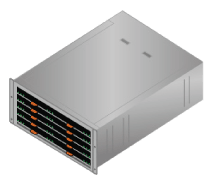

* *SG5612 enclosure, a 2U chassis with 12 drives*
+
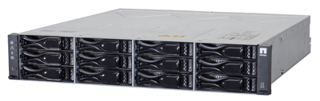

* *4U bezel or 2U endcaps*
+
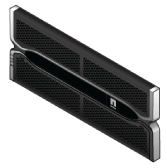 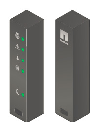

* *NL-SAS drives*
+
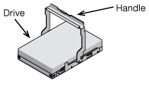
+
Drives are preinstalled in the 2U SG5612, but not in the 4U SG5660 for shipment safety.

* *E5600SG controller*
+
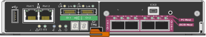

* *E2700 controller*
+
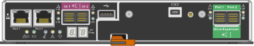

* *Mounting rails and screws*
+
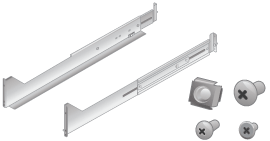

* *Enclosure handles (4U enclosures only)*
+
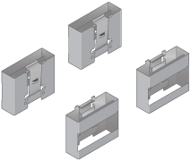

== Cables and connectors

The shipment for the StorageGRID appliance includes the following cables and connectors:

* *Power cords for your country*
+
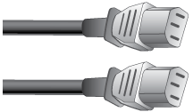
+
The appliance ships with two AC power cords for connecting to an external power source, such as a wall plug. Your cabinet might have special power cords that you use instead of the power cords that ship with the appliance.

* *SAS interconnect cables*
+
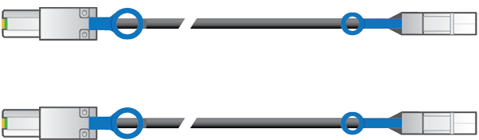
+
Two 0.5-meter SAS interconnect cables with mini-SAS-HD and mini-SAS connectors.
+
The square connector plugs into the E2700 controller, and the rectangular connector plugs into the E5600SG controller.
