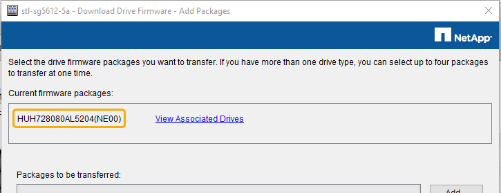
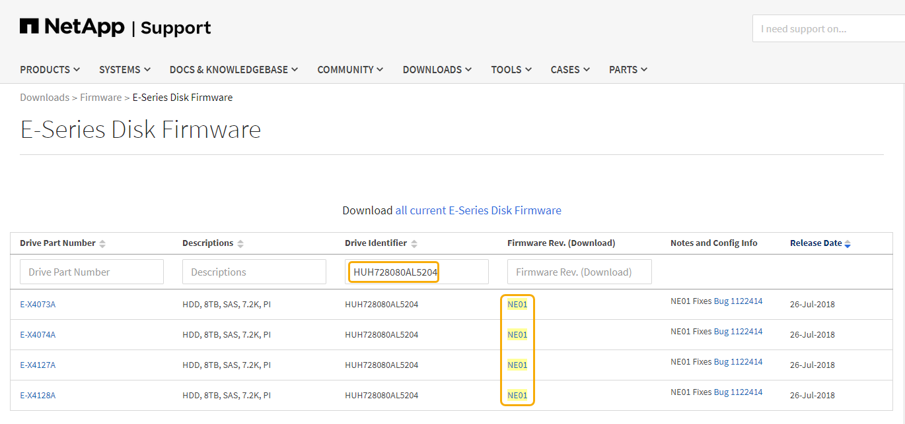

= Upgrading drive firmware using SANtricity Storage Manager
:icons: font
:imagesdir: ../media/

[.lead]
You upgrade your drive firmware to make sure you have all the latest features and bug fixes.

.What you'll need

* The storage appliance has an Optimal status.
* All drives have an Optimal status.
* You have the latest version of SANtricity Storage Manager installed that is compatible with your StorageGRID version.
+
xref:upgrading-santricity-os-on-storage-controllers-using-grid-manager-sg5600.adoc[Upgrading SANtricity OS on the storage controllers using the Grid Manager]
+
xref:upgrading-santricity-os-on-e2700-controller-using-maintenance-mode.adoc[Upgrading SANtricity OS on the E2700 controller using maintenance mode]

* You have placed the StorageGRID appliance in maintenance mode.
+
xref:placing-appliance-into-maintenance-mode.adoc[Placing an appliance into maintenance mode]
+
NOTE: Maintenance mode interrupts the connection to the storage controller, stopping all I/O activity and placing all drives offline.

IMPORTANT: Do not upgrade the drive firmware on more than one StorageGRID appliance at a time. Doing so might cause data unavailability, depending on your deployment model and ILM policies.

.Steps

. Open a web browser, and enter the IP address as the URL for SANtricity Storage Manager: +
`*https://_E2700_Controller_IP_*`
. Enter the SANtricity Storage Manager administrator username and password, if required.
. From SANtricity Enterprise Management, select the *Devices* tab.
+
The SANtricity Array Management window opens.

. From SANtricity Array Management, double-click the Storage Array with the drives to upgrade.
. Verify that both the Storage Array and drives have an Optimal status.
. Verify the drive firmware version currently installed in the storage appliance:
 .. From SANtricity Enterprise Management, select *Upgrade* > *Drive Firmware*.
+
The Download Drive Firmware - Add Packages window displays the drive firmware files currently in use.

 .. Note current drive firmware revisions and drive identifiers under Current firmware packages.
+

+
In this example:

  *** The drive firmware revision is *NE00*.
  *** The drive identifier is *HUH728080AL5204*.

+
Select *View Associated Drives* to display where these drives are installed in your storage appliance.
. Download and prepare the available drive firmware upgrade:
 .. Open your web browser, navigate to NetApp Support web site, and log in using your ID and password.
+
https://mysupport.netapp.com/site/[NetApp Support^]

 .. On the NetApp Support web site, select the *Downloads* tab, and then select *E-Series Disk Drive Firmware*.
+
The E-Series Disk Firmware page displays.

 .. Search for each *Drive Identifier* installed in your storage appliance and verify that each drive identifier has the latest firmware revision.
  *** If the firmware revision is not a link, this drive identifier has the latest firmware revision.
  *** If one or more drive part numbers are listed for a drive identifier, a firmware upgrade is available for these drives. You can select any link to download the firmware file.

 .. If a later firmware revision is listed, select the link in the Firmware Rev. (Download) column to download a `.zip` archive containing the firmware file.
 .. Extract (unzip) the drive firmware archive files you downloaded from the Support site.
. Install the drive firmware upgrade:
 .. From the SANtricity Storage Manager Download Drive Firmware - Add Packages window, select *Add*.
 .. Navigate to the directory that contains the firmware files and select up to four firmware files.
+
Drive firmware files have a filename similar to +
`D_HUC101212CSS600_30602291_MS01_2800_0002.dlp`
+
Selecting more than one firmware file to upgrade the firmware of the same drive might result in a file conflict error. If a file conflict error occurs, an error dialog appears. To resolve this error, select *OK* and remove all other firmware files except the one that you want to use for upgrading the firmware of the drive. To remove a firmware file, select the firmware file in the Packages to Be Transferred information area, and select *Remove*. In addition, you can only select up to four drive firmware packages at one time.

 .. Select *OK*.
+
The system updates the Packages to be transferred information area with the firmware files you selected.

 .. Select *Next*.
+
The Download Drive Firmware - Select Drives window opens.

  *** All drives in the appliance are scanned for configuration information and upgrade eligibility.
  *** You are presented with a selection (depending on what variety of drives you have in the storage array) of compatible drives that can be upgraded with the firmware you selected. The drives capable of being upgraded as an online operation are displayed by default.
  *** The selected firmware for the drive appears in the Proposed Firmware information area. If you must change the firmware, select *Back* to return to the previous dialog.

 .. From the Drive upgrade capability, select the *Parallel* download operation or *All*.
+
You can use either of these upgrade methods because the appliance is in maintenance mode, where I/O activity is stopped for all drives and all volumes.

 .. In Compatible Drives, select the drives for which you want to upgrade the selected firmware files.
  *** For one or more drives, select each drive you want to upgrade.
  *** For all compatible drives, select *Select all*.
+
The best practice is to upgrade all drives of the same model to the same firmware revision.
 .. Select *Finish*; then, type `yes` and select *OK*.
*** The drive firmware download and upgrade begins, with Download Drive Firmware - Progress indicating the status of the firmware transfer for all drives.
*** The status of each drive participating in the upgrade appears in the Transfer Progress column of Devices updated.
+
A parallel drive firmware upgrade operation can take as much as 90 seconds to complete if all drives are upgraded on a 24-drive system. On a larger system, the execution time is slightly longer.
+

 .. During the firmware upgrade process, you can: +
*** Select *Stop* to stop the firmware upgrade in progress. Any firmware upgrade currently in progress are completed. Any drives that have attempted firmware upgrade show their individual status. Any remaining drives are listed with a status of Not attempted.
+
IMPORTANT: Stopping the drive firmware upgrade in process might result in data loss or unavailable drives.

+
*** Select *Save As* to save a text report of the firmware upgrade progress summary. The report saves with a default .log file extension. If you want to change the file extension or directory, change the parameters in Save Drive Download Log.

.. Use Download Drive Firmware - Progress to monitor the progress of the drive firmware upgrades. The Drives Updated area contains a list of drives that are scheduled for firmware upgrade and the transfer status of each drive's download and upgrade.
+
The progress and status of each drive that is participating in the upgrade appears in the Transfer Progress column. Take the appropriate recommended action if any errors occur during the upgrade.

  **** *Pending*
+
This status is shown for an online firmware download operation that has been scheduled but has not yet started.

  **** *In progress*
+
The firmware is being transferred to the drive.

  **** *Reconstruction in progress*
+
This status is shown if a volume transfer takes place during the rapid reconstruction of a drive. This is typically due to a controller reset or failure and the controller owner transfers the volume.
+
The system will initiate a full reconstruction of the drive.

  **** *Failed - partial*
+
The firmware was only partially transferred to the drive before a problem prevented the rest of the file from being transferred.

  **** *Failed - invalid state*
+
The firmware is not valid.

  **** *Failed - other*
+
The firmware could not be downloaded, possibly because of a physical problem with the drive.

  **** *Not attempted*
+
The firmware was not downloaded, which may be due to a number of different reasons such as the download was stopped before it could occur, or the drive did not qualify for the upgrade, or the download could not occur due to an error.

  **** *Successful*
+
The firmware was downloaded successfully.
. After the drive firmware upgrade completes:
 ** To close the Drive Firmware Download Wizard, select *Close*.
 ** To start the wizard again, select *Transfer More*.
. Once the upgrade operation has completed, reboot the appliance. From the StorageGRID Appliance Installer, select *Advanced* > *Reboot Controller*, and then select one of these options:
 ** Select *Reboot into StorageGRID* to reboot the controller with the node rejoining the grid. Select this option if you are done working in maintenance mode and are ready to return the node to normal operation.
 ** Select *Reboot into Maintenance Mode* to reboot the controller with the node remaining in maintenance mode. Select this option if there are additional maintenance operations you need to perform on the node before rejoining the grid.
image:../media/reboot_controller_from_maintenance_mode.png[Reboot controller in maintenance mode]
+
It can take up to 20 minutes for the appliance to reboot and rejoin the grid. To confirm that the reboot is complete and that the node has rejoined the grid, go back to the Grid Manager. The *Nodes* tab should display a normal status image:../media/icon_alert_green_checkmark.png[icon alert green checkmark] for the appliance node, indicating that no alerts are active and the node is connected to the grid.
+
image::../media/node_rejoin_grid_confirmation.png[Appliance node rejoined grid]
