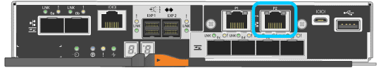

= Access StorageGRID Appliance Installer
:icons: font
:imagesdir: ../media/

[.lead]
You must access the StorageGRID Appliance Installer to configure the connections between the appliance and the three StorageGRID networks: the Grid Network, the Admin Network (optional), and the Client Network (optional).

.What you'll need

* You are using a xref:../admin/web-browser-requirements.adoc[supported web browser].
* The appliance is connected to all of the StorageGRID networks you plan to use.
* You know the IP address, gateway, and subnet for the appliance on these networks.
* You have configured the network switches you plan to use.

.About this task

When you first access the StorageGRID Appliance Installer, you can use the DHCP-assigned IP address for the Admin Network (assuming the appliance is connected to the Admin Network) or the DHCP-assigned IP address for the Grid Network. Using the IP address for the Admin Network is preferred. Otherwise, if you access the StorageGRID Appliance Installer using the DHCP address for the Grid Network, you might lose connection with the StorageGRID Appliance Installer when you change link settings and when you enter a static IP.

.Steps

. Obtain the DHCP address for the appliance on the Admin Network (if it is connected) or the Grid Network (if the Admin Network is not connected).
+
You can do either of the following:

 ** Look at the seven-segment display on the E5700SG controller. If management port 1 and 10/25-GbE ports 2 and 4 on the E5700SG controller are connected to networks with DHCP servers, the controller attempts to obtain dynamically assigned IP addresses when you power on the enclosure. After the controller has completed the power-on process, its seven-segment display shows *HO*, followed by a repeating sequence of two numbers.
+
----
HO -- IP address for Admin Network -- IP address for Grid Network HO
----
+
In the sequence:

  *** The first set of numbers is the DHCP address for the appliance Storage Node on the Admin Network, if it is connected. This IP address is assigned to management port 1 on the E5700SG controller.
  *** The second set of numbers is the DHCP address for the appliance Storage Node on the Grid Network. This IP address is assigned to 10/25-GbE ports 2 and 4 when you first apply power to the appliance.
+
NOTE: If an IP address could not be assigned using DHCP, 0.0.0.0 is displayed.

 ** Provide the MAC address for management port 1 to your network administrator, so they can look up the DHCP address for this port on the Admin Network. The MAC address is printed on a label on the E5700SG controller, next to the port.

. If you were able to obtain either of the DHCP addresses:
 .. Open a web browser on the service laptop.
 .. Enter this URL for the StorageGRID Appliance Installer: +
`*https://_E5700SG_Controller_IP_:8443*`
+
For `_E5700SG_Controller_IP_`, use the DHCP address for the controller (use the IP address for the Admin Network if you have it).

 .. If you are prompted with a security alert, view and install the certificate using the browser's installation wizard.
+
The alert will not appear the next time you access this URL.
+
The StorageGRID Appliance Installer Home page appears. The information and messages shown when you first access this page depend on how your appliance is currently connected to StorageGRID networks. Error messages might appear that will be resolved in later steps.
+
image::../media/appliance_installer_home_5700_5600.png[Screen shot of the top part of the StorageGRID Webscale Appliance Installer home page]
. If the E5700SG controller could not acquire an IP address using DHCP:
 .. Connect the service laptop to management port 2 on the E5700SG controller, using an Ethernet cable.
+

 .. Open a web browser on the service laptop.
 .. Enter this URL for the StorageGRID Appliance Installer: +
 `*\https://169.254.0.1:8443*`
+
The StorageGRID Appliance Installer Home page appears. The information and messages shown when you first access this page depend on how your appliance is currently connected.
+
NOTE: If you cannot access the Home page over a link-local connection, configure the service laptop IP address as `169.254.0.2`, and try again.
. Review any messages displayed on the Home page and configure the link configuration and the IP configuration, as required.

.Related information

xref:../admin/web-browser-requirements.adoc[Web browser requirements]
