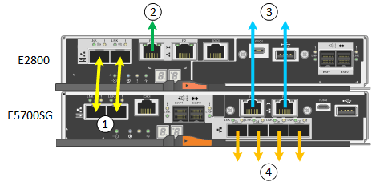

= Cabling the appliance (SG5700)
:icons: font
:imagesdir: ../media/

[.lead]
You must connect the two controllers to each other, connect the management ports on each controller, and connect the 10/25-GbE ports on the E5700SG controller to the Grid Network and optional Client Network for StorageGRID.

.What you'll need

* You have unpacked the following items, which are included with the appliance:
 ** Two power cords.
 ** Two optical cables for the FC interconnect ports on the controllers.
 ** Eight SFP+ transceivers, which support either 10-GbE or 16-Gbps FC. The transceivers can be used with the two interconnect ports on both controllers and with the four 10/25-GbE network ports on the E5700SG controller, assuming you want the network ports to use a 10-GbE link speed.
* You have obtained the following items, which are not included with the appliance:
 ** One to four optical cables for the 10/25-GbE ports you plan to use.
 ** One to four SFP28 transceivers, if you plan to use 25-GbE link speed.
 ** Ethernet cables for connecting the management ports.

CAUTION: *Risk of exposure to laser radiation* -- Do not disassemble or remove any part of an SFP transceiver. You might be exposed to laser radiation.

.About this task

The figure shows the two controllers in the SG5760, with the E2800 controller on the top and the E5700SG controller on the bottom. In the SG5712, the E2800 controller is to the left of the E5700SG controller when viewed from the back.

[options="header"]
|===
|  | Port| Type of port| Function
a|
1
a|
Two interconnect ports on each controller
a|
16Gb/s FC optical SFP+

a|
Connect the two controllers to each other.
a|
2
a|
Management port 1 on the E2800 controller
a|
1-GbE (RJ-45)
a|
Connects to the network where you access SANtricity System Manager. You can use the Admin Network for StorageGRID or an independent management network.
a|
2
a|
Management port 2 on the E2800 controller
a|
1-GbE (RJ-45)
a|
Reserved for technical support.
a|
3
a|
Management port 1 on the E5700SG controller
a|
1-GbE (RJ-45)
a|
Connects the E5700SG controller to the Admin Network for StorageGRID.
a|
3
a|
Management port 2 on the E5700SG controller
a|
1-GbE (RJ-45)
a|

* Can be bonded with management port 1 if you want a redundant connection to the Admin Network.
* Can be left unwired and available for temporary local access (IP 169.254.0.1).
* During installation, can be used to connect the E5700SG controller to a service laptop if DHCP-assigned IP addresses are not available.

a|
4
a|
10/25-GbE ports 1-4 on the E5700SG controller
a|
10-GbE or 25-GbE

*Note:* The SFP+ transceivers included with the appliance support 10-GbE link speeds. If you want to use 25-GbE link speeds for the four network ports, you must provide SFP28 transceivers.

a|
Connect to the Grid Network and the Client Network for StorageGRID. See "`10/25-GbE port connections for the E5700SG controller.`"
|===

.Steps

. Connect the E2800 controller to the E5700SG controller, using two optical cables and four of the eight SFP+ transceivers.
+
[options="header"]
|===
| Connect this port...| To this port...
a|
Interconnect port 1 on the E2800 controller
a|
Interconnect port 1 on the E5700SG controller
a|
Interconnect port 2 on the E2800 controller
a|
Interconnect port 2 on the E5700SG controller
|===

. Connect management port 1 (P1) on the E2800 controller (the RJ-45 port on the left) to the management network for SANtricity System Manager, using an Ethernet cable.
+
Do not use management port 2 (P2) on the E2800 controller (the RJ-45 port on the right). This port is reserved for technical support.

. If you plan to use the Admin Network for StorageGRID, connect management port 1 on the E5700SG controller (the RJ-45 port on the left) to the Admin Network, using an Ethernet cable.
+
If you plan to use active-backup network bond mode for the Admin Network, connect management port 2 on the E5700SG controller (the RJ-45 port on the right) to the Admin Network, using an Ethernet cable.

. Connect the 10/25-GbE ports on the E5700SG controller to the appropriate network switches, using optical cables and SFP+ or SFP28 transceivers.
+
NOTE: All ports must use the same link speed. Install SFP+ transceivers if you plan to use 10-GbE link speeds. Install SFP28 transceivers if you plan to use 25-GbE link speeds.

 ** If you plan to use Fixed port bond mode (default), connect the ports to the StorageGRID Grid and Client Networks, as shown in the table.
+
[options="header"]
|===
| Port| Connects to...
a|
Port 1
a|
Client Network (optional)
a|
Port 2
a|
Grid Network
a|
Port 3
a|
Client Network (optional)
a|
Port 4
a|
Grid Network
|===

 ** If you plan to use the Aggregate port bond mode, connect one or more of the network ports to one or more switches. You should connect at least two of the four ports to avoid having a single point of failure. If you use more than one switch for a single LACP bond, the switches must support MLAG or equivalent.

.Related information

xref:accessing-storagegrid-appliance-installer-sg5700.adoc[Accessing the StorageGRID Appliance Installer]

xref:port-bond-modes-for-e5700sg-controller-ports.adoc[Port bond modes for E5700SG controller ports]
