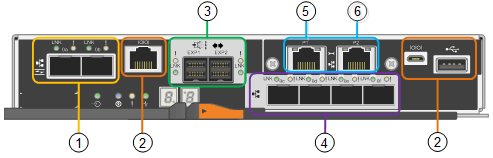

= Controllers in the StorageGRID appliance
:icons: font
:imagesdir: ../media/

[.lead]
Both the SG5712 and SG5760 models of the StorageGRID appliance include an E5700SG controller and an E2800 controller. You should review the diagrams to learn the differences between the controllers.

== E5700SG controller

* Operates as the compute server for the appliance.
* Includes the StorageGRID Appliance Installer.
+
NOTE: StorageGRID software is not preinstalled on the appliance. This software is accessed from the Admin Node when you deploy the appliance.

* Can connect to all three StorageGRID networks, including the Grid Network, the Admin Network, and the Client Network.
* Connects to the E2800 controller and operates as the initiator.

This figure shows the connectors on the back of the E5700SG controller.

[options="header"]
|===
|  | Port| Type| Use
a|
1
a|
Interconnect ports 1 and 2
a|
16Gb/s Fibre Channel (FC), optical SFPa|
Connect the E5700SG controller to the E2800 controller.
a|
2
a|
Diagnostic and support ports
a|

* RJ-45 serial port
* Micro USB serial port
* USB port

a|
Reserved for technical support.
a|
3
a|
Drive expansion ports
a|
12Gb/s SAS
a|
Not used. StorageGRID appliances do not support expansion drive shelves.
a|
4
a|
Network ports 1-4
a|
10-GbE or 25-GbE, based on SFP transceiver type, switch speed, and configured link speed
a|
Connect to the Grid Network and the Client Network for StorageGRID.
a|
5
a|
Management port 1
a|
1-Gb (RJ-45) Ethernet
a|
Connect to the Admin Network for StorageGRID.
a|
6
a|
Management port 2
a|
1-Gb (RJ-45) Ethernet
a|
Options:

* Bond with management port 1 for a redundant connection to the Admin Network for StorageGRID.
* Leave unwired and available for temporary local access (IP 169.254.0.1).
* During installation, use port 2 for IP configuration if DHCP-assigned IP addresses are not available.

|===

== E2800 controller

* Operates as the storage controller for the appliance.
* Manages the storage of data on the drives.
* Functions as a standard E-Series controller in simplex mode.
* Includes SANtricity OS Software (controller firmware).
* Includes SANtricity System Manager for monitoring appliance hardware and for managing alerts, the AutoSupport feature, and the Drive Security feature.
* Connects to the E5700SG controller and operates as the target.

This figure shows the connectors on the back of the E2800 controller.

image::../media/e2800_controller_with_callouts.gif[Connectors on E2800 controller]

[options="header"]
|===
|  | Port| Type| Use
a|
1
a|
Interconnect ports 1 and 2
a|
16Gb/s FC optical SFPa|
Connect the E2800 controller to the E5700SG controller.
a|
2
a|
Management ports 1 and 2
a|
1-Gb (RJ-45) Ethernet
a|

* Port 1 connects to the network where you access SANtricity System Manager on a browser.
* Port 2 is reserved for technical support use.

a|
3
a|
Diagnostic and support ports
a|

* RJ-45 serial port
* Micro USB serial port
* USB port

a|
Reserved for technical support use.
a|
4
a|
Drive expansion ports.
a|
12Gb/s SAS
a|
Not used. StorageGRID appliances do not support expansion drive shelves.
|===
