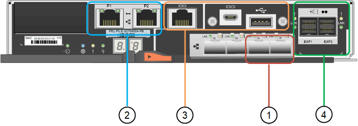

= Controllers in the StorageGRID 5700 appliance
:icons: font
:imagesdir: ../media/

[.lead]
Both the 12-drive SG5712 and SG5712X and the 60-drive SG5760 and SG5760X models of the StorageGRID appliance include an E5700SG compute controller and an E-Series E2800 storage controller. 

* The SG5712 and SG5760 use a E2800A controller. 
* The SG5712X and the SG5760X use a E2800B controller.

 The E2800A and E2800B controllers are identical in specification and function except for the location of the interconnect ports. 

You should review the diagrams to learn the differences among the controllers.

== E5700SG controller

* Operates as the compute server for the appliance.
* Includes the StorageGRID Appliance Installer.
+
NOTE: StorageGRID software is not preinstalled on the appliance. This software is accessed from the Admin Node when you deploy the appliance.

* Can connect to all three StorageGRID networks, including the Grid Network, the Admin Network, and the Client Network.
* Connects to the E2800 controller and operates as the initiator.

This figure shows the connectors on the back of the E5700SG controller.

image::../media/e5700sg_controller_with_callouts.gif[Connectors on E5700SG controller]

[options="header"]
|===
|  | Port| Type| Use
a|
1
a|
Interconnect ports 1 and 2
a|
16Gb/s Fibre Channel (FC), optical SFPa|
Connect the E5700SG controller to the E2800 controller.
a|
2
a|
Diagnostic and support ports
a|

* RJ-45 serial port
* Micro USB serial port
* USB port

a|
Reserved for technical support.
a|
3
a|
Drive expansion ports
a|
12Gb/s SAS
a|
Not used. StorageGRID appliances do not support expansion drive shelves.
a|
4
a|
Network ports 1-4
a|
10-GbE or 25-GbE, based on SFP transceiver type, switch speed, and configured link speed
a|
Connect to the Grid Network and the Client Network for StorageGRID.
a|
5
a|
Management port 1
a|
1-Gb (RJ-45) Ethernet
a|
Connect to the Admin Network for StorageGRID.
a|
6
a|
Management port 2
a|
1-Gb (RJ-45) Ethernet
a|
Options:

* Bond with management port 1 for a redundant connection to the Admin Network for StorageGRID.
* Leave unwired and available for temporary local access (IP 169.254.0.1).
* During installation, use port 2 for IP configuration if DHCP-assigned IP addresses are not available.

|===

== E2800 series storage controller

There are two versions of the E2800 storage controller used in the SG5700 appliances: E2800A and E2800B. The E2800A does not have a HIC, and the E2800B has a four-port HIC. The two controller versions have identical specifications and function except for the location of the interconnect ports. 

The E2800 series storage controller has the following specifications: 

* Operates as the storage controller for the appliance.
* Manages the storage of data on the drives.
* Functions as a standard E-Series controller in simplex mode.
* Includes SANtricity OS Software (controller firmware).
* Includes SANtricity System Manager for monitoring appliance hardware and for managing alerts, the AutoSupport feature, and the Drive Security feature.
* Connects to the E5700SG controller and operates as the target.

The following figures show the connectors on the back of the E2800A and E2800B controllers.

*Connectors on the back of the E2800A*

image::../media/e2800_controller_with_callouts.gif[Connectors on E2800A controller]

*Connectors on the back of the E2800B*

[options="header"]
|===
|  | Port| Type| Use
a|
1
a|
Interconnect ports 1 and 2
a|
16Gb/s FC optical SFPa|
Connect the E2800 controller to the E5700SG controller.
a|
2
a|
Management ports 1 and 2
a|
1-Gb (RJ-45) Ethernet
a|

* Port 1 Options:
** Connect to a management network to enable direct TCP/IP access to SANtricity System Manager
** Leave unwired to save a switch port and IP address.  Access SANtricity System Manager using the Grid Manager or Storage Grid Appliance Installer UIs.  

*Note*: some optional SANtricity functionality, such as NTP sync for accurate log timestamps, is not available when you choose to leave Port 1 unwired.

*Note*: StorageGRID 11.5 or greater, and SANtricity 11.70 or greater, are required when you leave Port 1 unwired.

* Port 2 is reserved for technical support use.

a|
3
a|
Diagnostic and support ports
a|

* RJ-45 serial port
* Micro USB serial port
* USB port

a|
Reserved for technical support use.
a|
4
a|
Drive expansion ports.
a|
12Gb/s SAS
a|
Not used.
|===