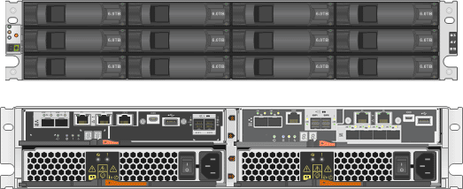
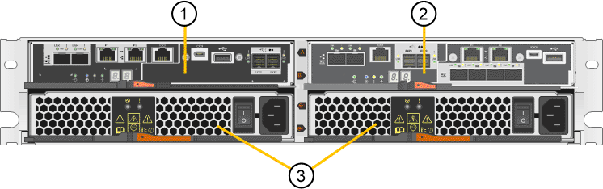
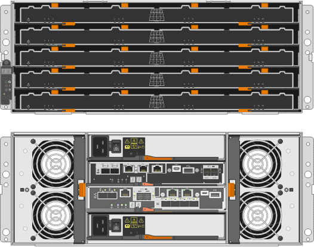
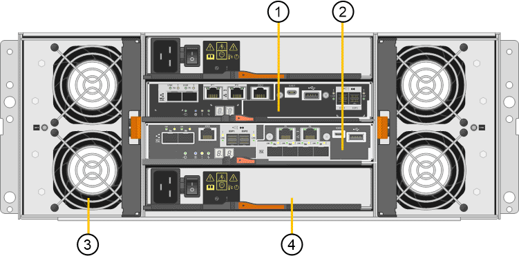

= SG5700 appliances: Overview
:icons: font
:imagesdir: ../media/

[.lead]
The SG5700 StorageGRID appliance is an integrated storage and computing platform that operates as a Storage Node in a StorageGRID grid. The appliance can be used in a hybrid grid environment that combines appliance Storage Nodes and virtual (software-based) Storage Nodes.

StorageGRID SG5700 appliances provide the following features:

* Integrates the storage and computing elements for a StorageGRID Storage Node.
* Includes the StorageGRID Appliance Installer to simplify Storage Node deployment and configuration.
* Includes E-Series SANtricity System Manager for hardware management and monitoring.
* Supports up to four 10-GbE or 25-GbE connections to the StorageGRID Grid Network and Client Network.
* Supports Full Disk Encryption (FDE) drives or Federal Information Processing Standard (FIPS) drives. When these drives are used with the Drive Security feature in SANtricity System Manager, unauthorized access to data is prevented.

The SG5700 appliance is available in four models: the 12-drive SG5712 and SG5712X, and the 60-drive SG5760 and SG5760X. 

The models include the following components:

[options="header"]
|===
| Component| SG5712 and SSG5712X| SG5760 and SG5760X
a|
Compute controller
a|
E5700SG controller
a|
E5700SG controller
a|
Storage controller
a|
E-Series E2800 controller

* E2800A for the SG5712
* E2800B for the SG5712X
a|
E-Series E2800 controller

* E2800A for the SG5760
* E2800B for the SG5760X
a|
Chassis
a|
E-Series DE212C enclosure, a two rack-unit (2U) enclosure
a|
E-Series DE460C enclosure, a four rack-unit (4U) enclosure
a|
Drives
a|
12 NL-SAS drives (3.5-inch)
a|
60 NL-SAS drives (3.5-inch)
a|
Redundant power supplies and fans
a|
Two power-fan canisters
a|
Two power canisters and two fan canisters
|===
The maximum raw storage available in the StorageGRID appliance is fixed, based on the number of drives in each enclosure. You cannot expand the available storage by adding a shelf with additional drives.

== Model SG5712 and SG5712X

The following figures show the front and back of the SG5712 and SG5712X models. Each model has a 2U enclosure that holds 12 drives. 

NOTE: The SG5712 and the SG5712X are identical in specification and function except for the location of the interconnect ports on the storage controller.

*Front and back of the SG5712*

*Front and back of the SG5712X*

image::../media/sg5712X_front_and_back_views.png[The front and back of the SG5712 appliance]

The SG5712 and SG5712X each include two controllers and two power-fan canisters.

*Controllers and power-fan canisters in the SG5712*

*Controllers and power-fan canisters in the SG5712X*

image::../media/sg5712X_with_callouts.gif[Controllers and power-fan canisters in the SG5712 appliance]

[options="header"]
|===
| Callout| Description
a|
1
a|
E2800A (storage controller in the SG5712)

E2800B (storage controller in the SG5712X)
a|
2
a|
E5700SG controller (compute controller)
a|
3
a|
Power-fan canisters
|===

== Model SG5760 and SG5760X

The following figures show the front and back of the SG5760 and SG5760X models. Each model has a 4U enclosure that holds 60 drives in 5 drive drawers.

NOTE: The SG5760 and the SG5760X are identical in specification and function except for the location of the interconnect ports on the storage controller.

*Front and back of the SG5760*

*Front and back of the SG5760X*

image::../media/sg5760X_front_and_back_views.png[Front and back of the SG5760X appliance]

The SG5760 and SG5760X each include two controllers, two fan canisters, and two power canisters.

*Controllers and power-fan canisters in the SG5760*

*Controllers and power-fan canisters in the SG5760X*

image::../media/sg5760X_with_callouts.png[Controllers and fan canisters and power canisters in SG5760X appliance]

[options="header"]
|===
| Callout| Description
a|
1
a|
E2800A (storage controller in the SG5760)

E2800B (storage controller in the SG5760X)
a|
2
a|
E5700SG controller (compute controller)
a|
3
a|
Fan canister (1 of 2)
a|
4
a|
Power canister (1 of 2)
|===

.Related information

http://mysupport.netapp.com/info/web/ECMP1658252.html[NetApp E-Series Systems Documentation Site^]
