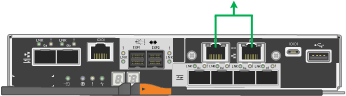

= Network bond modes for the 1-GbE management ports
:icons: font
:imagesdir: ../media/

[.lead]
For the two 1-GbE management ports on the E5700SG controller, you can choose Independent network bond mode or Active-Backup network bond mode to connect to the optional Admin Network.

In Independent mode, only management port 1 is connected to the Admin Network. This mode does not provide a redundant path. Management port 2 is left unwired and available for temporary local connections (use IP address 169.254.0.1)

In Active-Backup mode, both management ports 1 and 2 are connected to the Admin Network. Only one port is active at a time. If the active port fails, its backup port automatically provides a failover connection. Bonding these two physical ports into one logical management port provides a redundant path to the Admin Network.

NOTE: If you need to make a temporary local connection to the E5700SG controller when the 1-GbE management ports are configured for Active-Backup mode, remove the cables from both management ports, plug your temporary cable into management port 2, and access the appliance using IP address 169.254.0.1.

