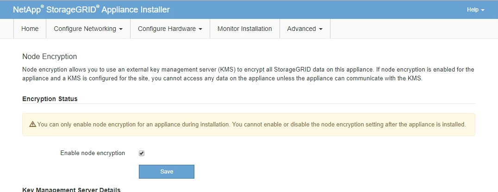

= Optional: Enabling node encryption
:icons: font
:imagesdir: ../media/

[.lead]
If you enable node encryption, the disks in your appliance can be protected by secure key management server (KMS) encryption against physical loss or removal from the site. You must select and enable node encryption during appliance installation and cannot unselect node encryption once the KMS encryption process starts.

.What you'll need

Review the information about KMS in the instructions for administering StorageGRID.

.About this task

An appliance that has node encryption enabled connects to the external key management server (KMS) that is configured for the StorageGRID site. Each KMS (or KMS cluster) manages the encryption keys for all appliance nodes at the site. These keys encrypt and decrypt the data on each disk in an appliance that has node encryption enabled.

A KMS can be set up in Grid Manager before or after the appliance is installed in StorageGRID. See the information about KMS and appliance configuration in the instructions for administering StorageGRID for additional details.

* If a KMS is set up before installing the appliance, KMS-controlled encryption begins when you enable node encryption on the appliance and add it to a StorageGRID site where KMS is configured.
* If a KMS is not set up before you install the appliance, KMS-controlled encryption is performed on each appliance that has node encryption enabled as soon as a KMS is configured and available for the site that contains the appliance node.

IMPORTANT: Any data that exists before an appliance that has node encryption enabled connects to the configured KMS is encrypted with a temporary key that is not secure. The appliance is not protected from removal or theft until the key is set to a value provided by the KMS.

Without the KMS key needed to decrypt the disk, data on the appliance cannot be retrieved and is effectively lost. This is the case whenever the decryption key cannot be retrieved from the KMS. The key becomes inaccessible if a customer clears the KMS configuration, a KMS key expires, connection to the KMS is lost, or the appliance is removed from the StorageGRID system where its KMS keys are installed.

.Steps

. Open a browser, and enter one of the IP addresses for the appliance's compute controller. +
`*https://_Controller_IP_:8443*`
+
`_Controller_IP_` is the IP address of the compute controller (not the storage controller) on any of the three StorageGRID networks.
+
The StorageGRID Appliance Installer Home page appears.
+
IMPORTANT: After the appliance has been encrypted with a KMS key, the appliance disks cannot be decrypted without using the same KMS key.

. Select *Configure Hardware* > *Node Encryption*.
+

. Select *Enable node encryption*.
+
You can unselect *Enable node encryption* without risk of data loss until you select *Save* and the appliance node accesses the KMS encryption keys in your StorageGRID system and begins disk encryption. You are not able to disable node encryption after the appliance is installed.
+
IMPORTANT: After you add an appliance that has node encryption enabled to a StorageGRID site that has a KMS, you cannot stop using KMS encryption for the node.

. Select *Save*.
. Deploy the appliance as a node in your StorageGRID system.
+
KMS-controlled encryption begins when the appliance accesses the KMS keys configured for your StorageGRID site. The installer displays progress messages during the KMS encryption process, which might take a few minutes depending on the number of disk volumes in the appliance.
+
NOTE: Appliances are initially configured with a random non-KMS encryption key assigned to each disk volume. The disks are encrypted using this temporary encryption key, that is not secure, until the appliance that has node encryption enabled accesses the KMS keys configured for your StorageGRID site.

.After you finish

You can view node-encryption status, KMS details, and the certificates in use when the appliance node is in maintenance mode.

.Related information

xref:../admin/index.adoc[Administer StorageGRID]

xref:monitoring-node-encryption-in-maintenance-mode.adoc[Monitoring node encryption in maintenance mode]
