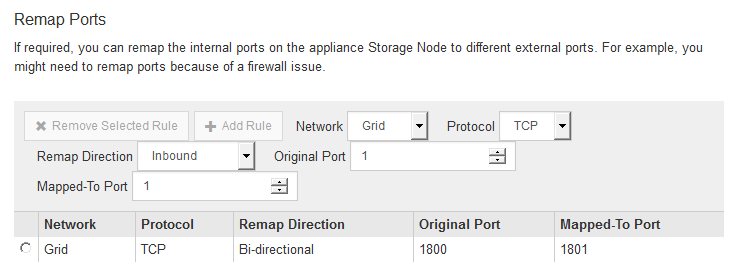

= Optional: Remapping network ports for the appliance
:icons: font
:imagesdir: ../media/

[.lead]
You might need to remap the internal ports on the appliance Storage Node to different external ports. For example, you might need to remap ports because of a firewall issue.

.What you'll need

* You have previously accessed the StorageGRID Appliance Installer.
* You have not configured and do not plan to configure load balancer endpoints.
+
IMPORTANT: If you remap any ports, you cannot use the same ports to configure load balancer endpoints. If you want to configure load balancer endpoints and have already remapped ports, follow the steps in the recovery and maintenance instructions for removing port remaps.

.Steps

. From the menu bar of the StorageGRID Appliance Installer, click *Configure Networking* > *Remap Ports*.
+
The Remap Port page appears.

. From the *Network* drop-down box, select the network for the port you want to remap: Grid, Admin, or Client.
. From the *Protocol* drop-down box, select the IP protocol: TCP or UDP.
. From the *Remap Direction* drop-down box, select which traffic direction you want to remap for this port: Inbound, Outbound, or Bi-directional.
. For *Original Port*, enter the number of the port you want to remap.
. For *Mapped-To Port*, enter the number of the port you want to use instead.
. Click *Add Rule*.
+
The new port mapping is added to the table, and the remapping takes effect immediately.
+

. To remove a port mapping, select the radio button for the rule you want to remove, and click *Remove Selected Rule*.
