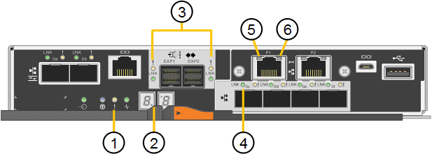

= Status indicators on the E5700SG controller
:icons: font
:imagesdir: ../media/

[.lead]
The seven-segment display and the LEDs on the E5700SG controller show status and error codes while the appliance powers up and while the hardware is initializing. You can use these displays to determine status and troubleshoot errors.

After the StorageGRID Appliance Installer has started, you should periodically review the status indicators on the E5700SG controller.

|===
|  | Display| State| Description
a|
1
a|
Attention LED
a|
Amber
a|
The controller is faulty and requires operator attention, or the installation script was not found.
a|
Off
a|
The controller is operating normally.
a|
2
a|
Seven-segment display
a|
Shows a diagnostic code
a|
Seven-segment display sequences enable you to understand errors and the operational state of the appliance.
a|
3
a|
Expansion Port Attention LEDs
a|
Amber
a|
These LEDs are always amber (no link established) because the appliance does not use the expansion ports.
a|
4
a|
Host Port Link Status LEDs
a|
Green
a|
The link is up.
a|
Off
a|
The link is down.
a|
5
a|
Ethernet Link State LEDs
a|
Green
a|
A link is established.
a|
Off
a|
No link is established.
a|
6
a|
Ethernet Activity LEDs
a|
Green
a|
The link between the management port and the device to which it is connected (such as an Ethernet switch) is up.
a|
Off
a|
There is no link between the controller and the connected device.
a|
Blinking Green
a|
There is Ethernet activity.
|===

== General boot-up codes

During boot-up or after a hard reset of the appliance, the following occurs:

. The seven-segment display on the E5700SG controller shows a general sequence of codes that is not specific to the controller. The general sequence ends with the codes AA and FF.
. Boot-up codes that are specific to the E5700SG controller appear.

== E5700SG controller boot-up codes

During a normal boot-up of the appliance, the seven-segment display on the E5700SG controller shows the following codes in the order listed:

|===
| Code| Indicates
a|
HI
a|
The master boot script has started.
a|
PP
a|
The system is checking to see if the FPGA needs to be updated.
a|
HP
a|
The system is checking to see if the 10/25-GbE controller firmware needs to be updated.
a|
RB
a|
The system is rebooting after applying firmware updates.
a|
FP
a|
The hardware subsystem firmware update checks have been completed. Inter-controller communication services are starting.
a|
HE
a|
The system is awaiting connectivity with the E2800 controller and synchronizing with the SANtricity operating system.*Note:* If this boot procedure does not progress past this stage, check the connections between the two controllers.

a|
HC
a|
The system is checking for existing StorageGRID installation data.
a|
HO
a|
The StorageGRID Appliance Installer is running.
a|
HA
a|
StorageGRID is running.
|===

== E5700SG controller error codes

These codes represent error conditions that might be shown on the E5700SG controller as the appliance boots up. Additional two-digit hexadecimal codes are displayed if specific low-level hardware errors occur. If any of these codes persists for more than a second or two, or if you are unable to resolve the error by following one of the prescribed troubleshooting procedures, contact technical support.

|===
| Code| Indicates
a|
22
a|
No master boot record found on any boot device.
a|
23
a|
The internal flash disk is not connected.
a|
2A, 2B
a|
Stuck bus, unable to read DIMM SPD data.
a|
40
a|
Invalid DIMMs.
a|
41
a|
Invalid DIMMs.
a|
42
a|
Memory test failed.
a|
51
a|
SPD reading failure.
a|
92 to 96
a|
PCI bus initialization.
a|
A0 to A3
a|
SATA drive initialization.
a|
AB
a|
Alternate boot code.
a|
AE
a|
Booting OS.
a|
EA
a|
DDR4 training failed.
a|
E8
a|
No memory installed.
a|
EU
a|
The installation script was not found.
a|
EP
a|
Installation or communication with the E2800 controller has failed.
|===
*Related information*

xref:reference_troubleshooting_the_hardware_installation.adoc[Troubleshooting the hardware installation]

https://mysupport.netapp.com/site/global/dashboard[NetApp Support]
