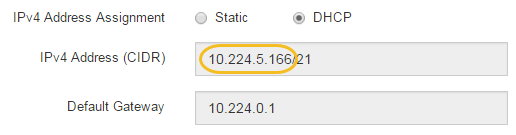
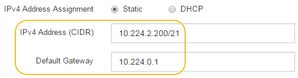

= Setting the IP addresses for the storage controllers using the StorageGRID Appliance Installer
:icons: font
:imagesdir: ../media/

[.lead]
Management port 1 on each storage controller connects the appliance to the management network for SANtricity System Manager. If you cannot access to the SANtricity System Manager from the StorageGRID Appliance Installer, you must set a static IP address for each storage controller to ensure that you do not lose your management connection to the hardware and the controller firmware in the controller shelf.

.What you'll need

* You are using any management client that can connect to the StorageGRID Admin Network, or you have a service laptop.
* The client or service laptop has a supported web browser.

.About this task

DHCP-assigned addresses can change at any time. Assign static IP addresses to the controllers to ensure consistent accessibility.

NOTE: Follow this procedure only if you do not have access to SANtricity System Manager from the StorageGRID Appliance Installer (*Advanced* > *SANtricity System Manager*) or Grid Manager (*Nodes* > *SANtricity System Manager*).

.Steps

. From the client, enter the URL for the StorageGRID Appliance Installer: +
`*https://_Appliance_Controller_IP_:8443*`
+
For `_Appliance_Controller_IP_`, use the IP address for the appliance on any StorageGRID network.
+
The StorageGRID Appliance Installer Home page appears.

. Select *Configure Hardware* > *Storage Controller Network Configuration*.
+
The Storage Controller Network Configuration page appears.

. Depending on your network configuration, select *Enabled* for IPv4, IPv6, or both.
. Make a note of the IPv4 address that is automatically displayed.
+
DHCP is the default method for assigning an IP address to the storage controller management port.
+
NOTE: It might take a few minutes for the DHCP values to appear.
+

. Optionally, set a static IP address for the storage controller management port.
+
NOTE: You should either assign a static IP for the management port or assign a permanent lease for the address on the DHCP server.

 .. Select *Static*.
 .. Enter the IPv4 address, using CIDR notation.
 .. Enter the default gateway.
+

 .. Click *Save*.
+
It might take a few minutes for your changes to be applied.
+
When you connect to SANtricity System Manager, you will use the new static IP address as the URL: +
`*https://_Storage_Controller_IP_*`
