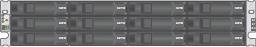
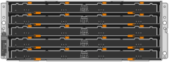
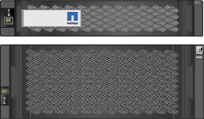
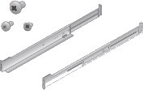
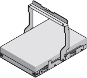
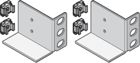
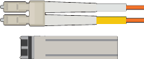

= Unpacking the boxes (SG5700)
:icons: font
:imagesdir: ../media/

[.lead]
Before installing the StorageGRID appliance, unpack all boxes and compare the contents to the items on the packing slip.

* *SG5712 appliance with 12 drives installed*
+

* *SG5760 appliance with no drives installed*
+

* *Front bezel for the appliance*
+

* *Rail kit with instructions*
+

* *SG5760: Sixty drives*
+

* *SG5760: Handles*
+
image::../media/handles.gif[SG5760 handles]

* *SG5760: Back brackets and cage nuts for square-hole rack installation*
+

== Cables and connectors

The shipment for the StorageGRID appliance includes the following cables and connectors:

* *Two power cords for your country*
+

+
Your cabinet might have special power cords that you use instead of the power cords that ship with the appliance.

* *Optical cables and SFP transceivers*
+

+
Two optical cables for the FC interconnect ports
+
Eight SFP+ transceivers, compatible with both the four 16Gb/s FC interconnect ports and the four 10-GbE network ports
