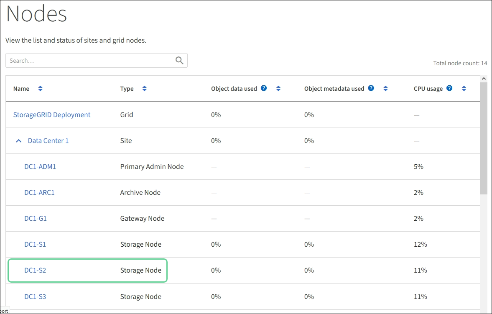

= Upgrading SANtricity OS on the E2800 controller using maintenance mode
:icons: font
:imagesdir: ../media/

[.lead]
For storage controllers currently using SANtricity OS older than 08.42.20.00 (11.42), you must use the maintenance mode procedure to apply an upgrade.

.What you'll need

* You have consulted the NetApp Interoperability Matrix Tool (IMT) to confirm that the SANtricity OS version you are using for the upgrade is compatible with your appliance.
* You must place the E5700SG controller into maintenance mode, which interrupts the connection to the E2800 controller. Putting a StorageGRID appliance into maintenance mode might make the appliance unavailable for remote access.
+
xref:placing-appliance-into-maintenance-mode.adoc[Placing an appliance into maintenance mode]

.About this task

Do not upgrade the SANtricity OS or NVSRAM in the E-Series controller on more than one StorageGRID appliance at a time.

IMPORTANT: Upgrading more than one StorageGRID appliance at a time might cause data unavailability, depending on your deployment model and ILM policies.

.Steps

. From a service laptop, access SANtricity System Manager and sign in.
. Download the new SANtricity OS Software file and NVSRAM file to the management client.
+
IMPORTANT: The NVSRAM is specific to the StorageGRID appliance. Do not use the standard NVSRAM download.

. Follow the instructions in the _E2800 and E5700 SANtricity Software and Firmware Upgrade Guide_ or the SANtricity System Manager online help to upgrade the E2800 controller's firmware and NVSRAM.
+
NOTE: Activate the upgrade files immediately. Do not defer activation.

. Once the upgrade operation has completed, reboot the node. From the StorageGRID Appliance Installer, select *Advanced* > *Reboot Controller*, and then select one of these options:
 ** Select *Reboot into StorageGRID* to reboot the controller with the node rejoining the grid. Select this option if you are done working in maintenance mode and are ready to return the node to normal operation.
 ** Select *Reboot into Maintenance Mode* to reboot the controller with the node remaining in maintenance mode. Select this option if there are additional maintenance operations you need to perform on the node before rejoining the grid.
image:../media/reboot_controller_from_maintenance_mode.png[Reboot controller in maintenance mode]
+
It can take up to 20 minutes for the appliance to reboot and rejoin the grid. To confirm that the reboot is complete and that the node has rejoined the grid, go back to the Grid Manager. The *Nodes* tab should display a normal status image:../media/icon_alert_green_checkmark.png[icon alert green checkmark] for the appliance node, indicating that no alerts are active and the node is connected to the grid.
+

.Related information

xref:upgrading-santricity-os-on-storage-controllers-using-grid-manager-sg5700.adoc[Upgrading SANtricity OS on the storage controllers using the Grid Manager]
