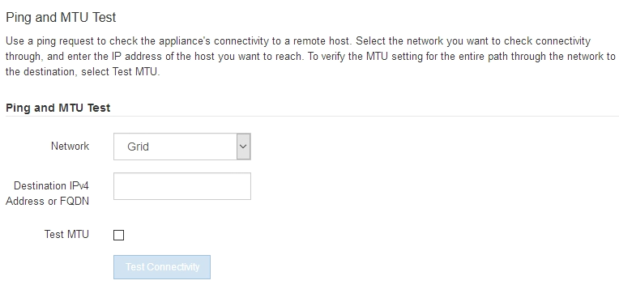
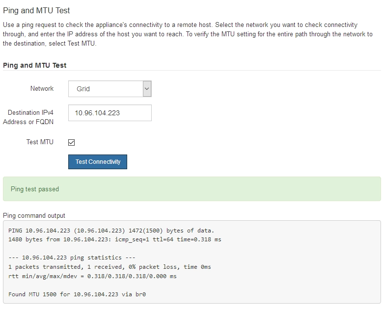

= Verifying network connections
:icons: font
:imagesdir: ../media/

[.lead]
You should confirm you can access the StorageGRID networks you are using from the appliance. To validate routing through network gateways, you should test connectivity between the StorageGRID Appliance Installer and IP addresses on different subnets. You can also verify the MTU setting.

.Steps

. From the menu bar of the StorageGRID Appliance Installer, click *Configure Networking* > *Ping and MTU Test*.
+
The Ping and MTU Test page appears.
+

. From the *Network* drop-down box, select the network you want to test: Grid, Admin, or Client.
. Enter the IPv4 address or fully qualified domain name (FQDN) for a host on that network.
+
For example, you might want to ping the gateway on the network or the primary Admin Node.

. Optionally, select the *Test MTU* check box to verify the MTU setting for the entire path through the network to the destination.
+
For example, you can test the path between the appliance node and a node at a different site.

. Click *Test Connectivity*.
+
If the network connection is valid, the "Ping test passed" message appears, with the ping command output listed.
+

.Related information

xref:configuring-network-links-sg5700.adoc[Configuring network links (SG5700)]

xref:changing-mtu-setting.adoc[Changing the MTU setting]
