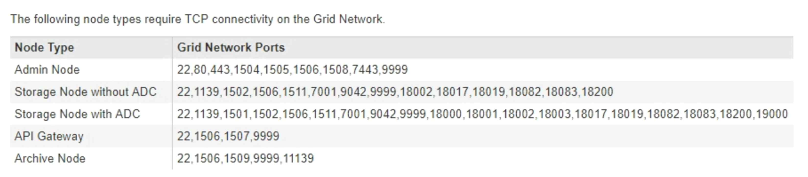
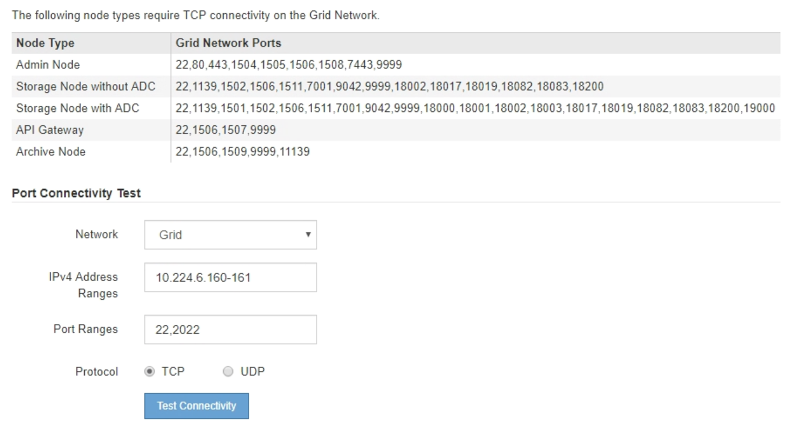
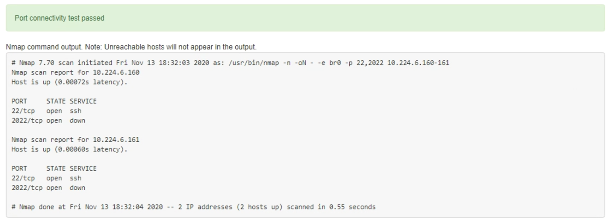
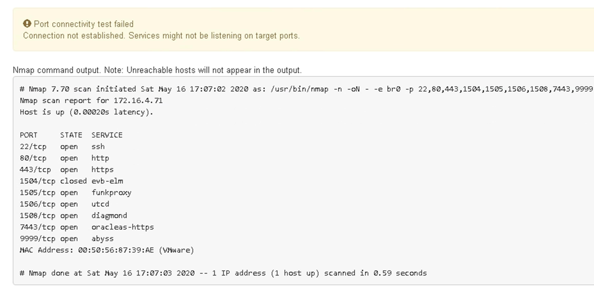
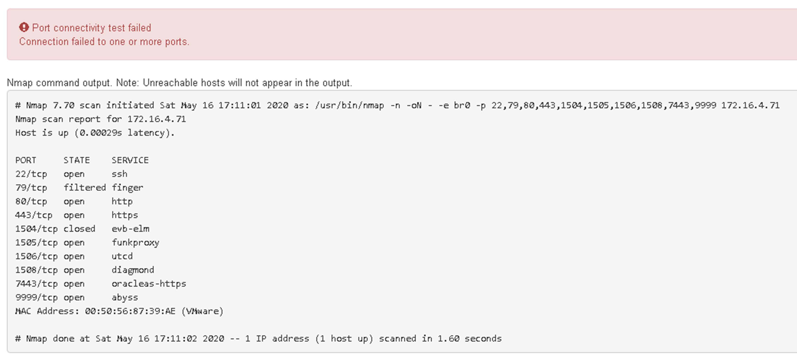

= Verifying port-level network connections
:icons: font
:imagesdir: ../media/

[.lead]
To ensure that access between the StorageGRID Appliance Installer and other nodes is not obstructed by firewalls, confirm that the StorageGRID Appliance Installer can connect to a specific TCP port or set of ports at the specified IP address or range of addresses.

.About this task

Using the list of ports provided in the StorageGRID Appliance Installer, you can test the connectivity between the appliance and the other nodes in your Grid Network.

Additionally, you can test connectivity on the Admin and Client Networks and on UDP ports, such as those used for external NFS or DNS servers. For a list of these ports, see the port reference in the StorageGRID networking guidelines.

NOTE: The Grid Network ports listed in the port connectivity table are valid only for StorageGRID version 11.5.0. To verify which ports are correct for each node type, you should always consult the networking guidelines for your version of StorageGRID.

.Steps

. From the StorageGRID Appliance Installer, click *Configure Networking* > *Port Connectivity Test (nmap)*.
+
The Port Connectivity Test page appears.
+
The port connectivity table lists node types that require TCP connectivity on the Grid Network. For each node type, the table lists the Grid Network ports that should be accessible to your appliance.
+

+
You can test the connectivity between the appliance ports listed in the table and the other nodes in your Grid Network.

. From the *Network* drop-down, select the network you want to test: *Grid*, *Admin*, or *Client*.
. Specify a range of IPv4 addresses for the hosts on that network.
+
For example, you might want to probe the gateway on the network or the primary Admin Node.
+
Specify a range using a hyphen, as shown in the example.

. Enter a TCP port number, a list of ports separated by commas, or a range of ports.
+

. Click *Test Connectivity*.
 ** If the selected port-level network connections are valid, the "`Port connectivity test passed`" message appears in a green banner. The nmap command output is listed below the banner.
+

 ** If a port-level network connection is made to the remote host, but the host is not listening on one or more of the selected ports, the "`Port connectivity test failed`" message appears in a yellow banner. The nmap command output is listed below the banner.
+
Any remote port the host is not listening to has a state of "`closed.`" For example, you might see this yellow banner when the node you are trying to connect to is in a pre-installed state and the StorageGRID NMS service is not yet running on that node.
+

 ** If a port-level network connection cannot be made for one or more selected ports, the "`Port connectivity test failed`" message appears in a red banner. The nmap command output is listed below the banner.
+
The red banner indicates that a TCP connection attempt to a port on the remote host was made, but nothing was returned to the sender. When no response is returned, the port has a state of "filtered" and is likely blocked by a firewall.
+
NOTE: Ports with "`closed`" are also listed.
+

.Related information

xref:../network/index.adoc[Network guidelines]
