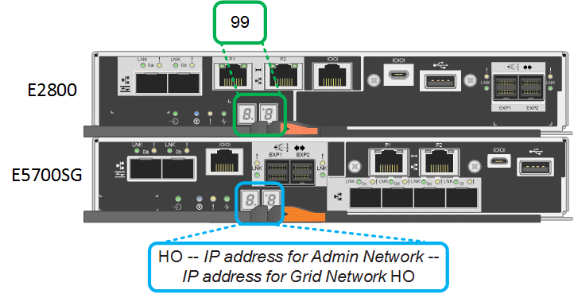

= Viewing SG5700 boot-up status codes
:icons: font
:imagesdir: ../media/

[.lead]
The seven-segment displays on each controller show status and error codes as the appliance powers up.

.About this task

The E2800 controller and the E5700SG controller display different statuses and error codes.

To understand what these codes mean, see the following resources:

[options="header"]
|===
| Controller| Reference
a|
E2800 controller
a|
_E5700 and E2800 System Monitoring Guide_

*Note:* The codes listed for the E-Series E5700 controller do not apply to the E5700SG controller in the appliance.

a|
E5700SG controller
a|
"`Status indicators on the E5700SG controller`"

|===

.Steps

. During boot-up, monitor progress by viewing the codes shown on the seven-segment displays.
 ** The seven-segment display on the E2800 controller shows the repeating sequence *OS*, *Sd*, `*_blank_*` to indicate that it is performing start-of-day processing.
 ** The seven-segment display on the E5700SG controller shows a sequence of codes, ending with *AA* and *FF*.
. After the controllers have booted up, confirm the seven-segment displays show the following:
+

+
[options="header"]
|===
| Controller| Seven-segment display
a|
E2800 controller
a|
Shows 99, which is the default ID for an E-Series controller shelf.
a|
E5700SG controller
a|
Shows *HO*, followed by a repeating sequence of two numbers.

----
HO -- IP address for Admin Network -- IP address for Grid Network HO
----

In the sequence, the first set of numbers is the DHCP-assigned IP address for the controller's management port 1. This address is used to connect the controller to the Admin Network for StorageGRID. The second set of numbers is the DHCP-assigned IP address used to connect the appliance to the Grid Network for StorageGRID.

*Note:* If an IP address could not be assigned using DHCP, 0.0.0.0 is displayed.

|===

. If the seven-segment displays show other values, see "`Troubleshooting the hardware installation,`" and confirm you completed the installation steps correctly. If you are unable to resolve the problem, contact technical support.

.Related information

xref:status_indicators_on_e5700sg_controller.adoc[Status indicators on the E5700SG controller]

xref:troubleshooting_hardware_installation.adoc[Troubleshooting the hardware installation]

https://library.netapp.com/ecm/ecm_download_file/ECMLP2531141[E5700 and E2800 System Monitoring Guide]
