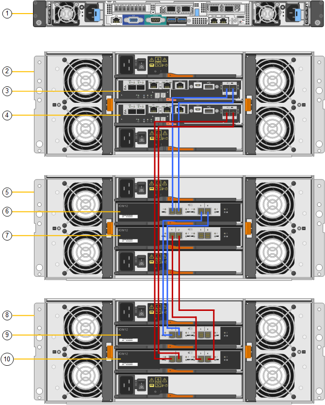
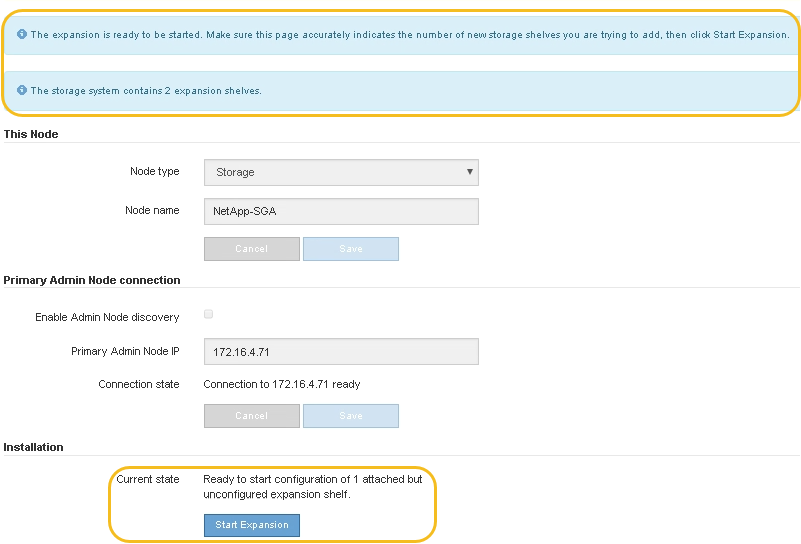
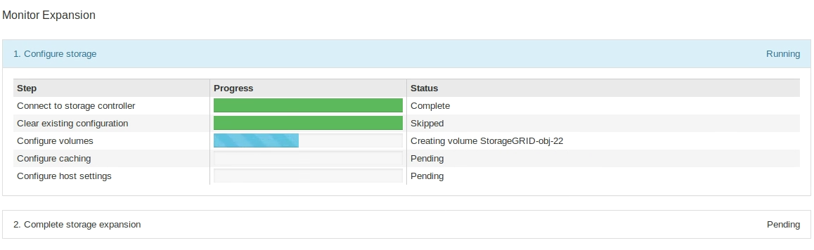
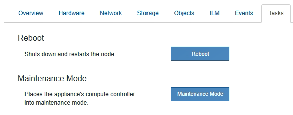
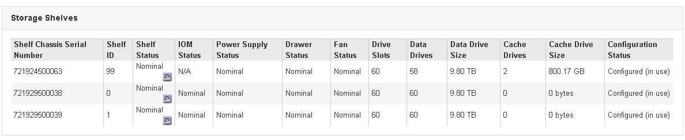

= Adding an expansion shelf to a deployed SG6060
:icons: font
:imagesdir: ../media/

[.lead]
To increase storage capacity, you can add one or two expansion shelves to an SG6060 that is deployed in a StorageGRID system.

.What you'll need

* You must have the provisioning passphrase.
* You must be running StorageGRID 11.4 or later.
* You have the expansion shelf and two SAS cables for each expansion shelf.
* You have physically located the storage appliance where you are adding the expansion shelf in the data center.
+
xref:locating-controller-in-data-center.adoc[Locating the controller in a data center]

.About this task

To add an expansion shelf, you perform these high-level steps:

* Install the hardware in the cabinet or rack.
* Place the SG6060 into maintenance mode.
* Connect the expansion shelf to the E2860 controller shelf or to another expansion shelf.
* Start the expansion using the StorageGRID Appliance Installer
* Wait until the new volumes are configured.

Completing the procedure for one or two expansion shelves should take one hour or less per appliance node. To minimize downtime, the following steps instruct you to install the new expansion shelves and drives before placing the SG6060 into maintenance mode. The remaining steps should take approximately 20 to 30 minutes per appliance node.

.Steps

. Follow the instructions for installing 60-drive shelves into a cabinet or rack.
+
xref:sg6060-installing-60-drive-shelves-into-cabinet-or-rack.adoc[SG6060: Installing 60-drive shelves into a cabinet or rack]

. Follow the instructions for installing the drives.
+
xref:sg6060-installing-drives.adoc[SG6060: Installing the drives]

. From the Grid Manager, place the SG6000-CN controller into maintenance mode.
+
xref:placing-appliance-into-maintenance-mode.adoc[Placing an appliance into maintenance mode]

. Connect each expansion shelf to the E2860 controller shelf as shown in the diagram.
+
This drawing shows two expansion shelves. If you have only one, connect IOM A to controller A and connect IOM B to controller B.
+

+
[options="header"]
|===
| Callout| Description
a|
1
a|
SG6000-CN
a|
2
a|
E2860 controller shelf
a|
3
a|
Controller A
a|
4
a|
Controller B
a|
5
a|
Expansion shelf 1
a|
6
a|
IOM A for expansion shelf 1
a|
7
a|
IOM B for expansion shelf 1
a|
8
a|
Expansion shelf 2
a|
9
a|
IOM A for expansion shelf 2
a|
10
a|
IOM B for expansion shelf 2
|===

. Connect the power cords and apply power to the expansion shelves.
 .. Connect a power cord to each of the two power supply units in each expansion shelf.
 .. Connect the two power cords in each expansion shelf to two different PDUs in the cabinet or rack.
 .. Turn on the two power switches for each expansion shelf.
  *** Do not turn off the power switches during the power-on process.
  *** The fans in the expansion shelves might be very loud when they first start up. The loud noise during start-up is normal.
. Monitor the Home page of the StorageGRID Appliance Installer.
+
In approximately five minutes, the expansion shelves finish powering up and are detected by the system. The Home page shows the number of new expansion shelves detected, and the Start Expansion button is enabled.
+
The screenshot shows examples of the messages that could appear on the Home page, depending on the number of existing or new expansion shelves, as follows:

 ** The banner circled at the top of the page indicates the total number of expansion shelves detected.
  *** The banner indicates the total number of expansion shelves, whether the shelves are configured and deployed or new and unconfigured.
  *** If no expansion shelves are detected, the banner will not appear.
 ** The message circled at the bottom of the page indicates an expansion is ready to be started.
  *** The message indicates the number of new expansion shelves StorageGRID detects. "`Attached`" indicates that the shelf is detected. "`Unconfigured`" indicates that the shelf is new and not yet configured using the StorageGRID Appliance Installer.
+
NOTE: Expansion shelves that are already deployed are not included in this message. They are included in the count in the banner at the top of the page.

  *** The message will not appear if new expansion shelves are not detected.
+

. As necessary, resolve any issues described in the messages on the Home page.
+
For example, use SANtricity System Manager to resolve any storage hardware issues.

. Verify that the number of expansion shelves displayed on the Home page matches the number of expansion shelves you are adding.
+
NOTE: If the new expansion shelves have not been detected, verify that they are properly cabled and powered up.

. Click *Start Expansion* to configure the expansion shelves and make them available for object storage.
. Monitor the progress of the expansion shelf configuration.
+
Progress bars appear on the web page, just as they do during initial installation.
+

+
When configuration is complete, the appliance automatically reboots to exit maintenance mode and rejoin the grid. This process can take up to 20 minutes.
+
NOTE: If the appliance does not rejoin the grid, go to the StorageGRID Appliance Installer Home page, select *Advanced* > *Reboot Controller*, and then select *Reboot into Maintenance Mode*.
+
When the reboot is complete, the *Tasks* tab looks like the following screenshot:
+

. Verify the status of the appliance Storage Node and the new expansion shelves.
 .. In the Grid Manager, select *Nodes* and verify that the appliance Storage Node has a green checkmark icon.
+
The green checkmark icon means that no alerts are active and the node is connected to the grid. For a description of node icons, see the instructions for monitoring and troubleshooting StorageGRID.

 .. Select the *Storage* tab and confirm that 16 new object stores are shown in the Object Storage table for each expansion shelf you added.
 .. Verify that each new expansion shelf has a shelf status of Nominal and a configuration status of Configured.
+

.Related information

xref:unpacking-boxes-sg6000.adoc[Unpacking the boxes (SG6000)]

xref:sg6060-installing-60-drive-shelves-into-cabinet-or-rack.adoc[SG6060: Installing 60-drive shelves into a cabinet or rack]

xref:sg6060-installing-drives.adoc[SG6060: Installing the drives]

xref:../monitor/index.adoc[Monitor & troubleshoot]
