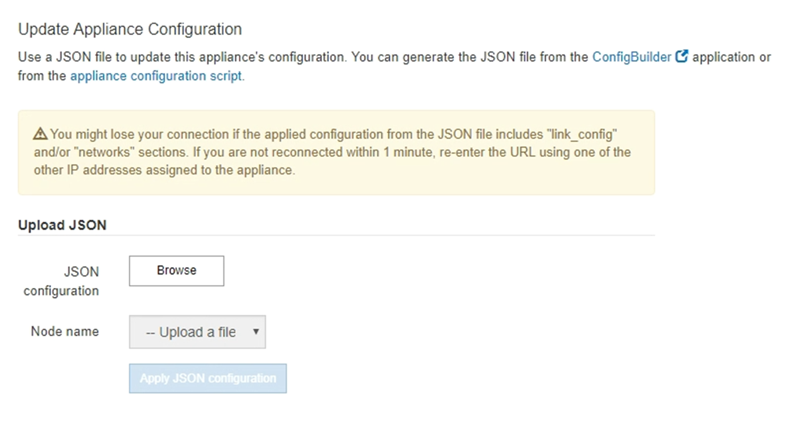
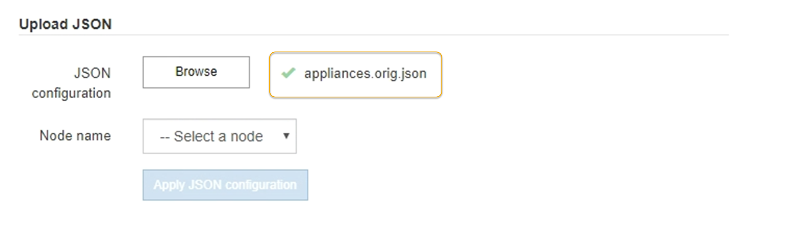
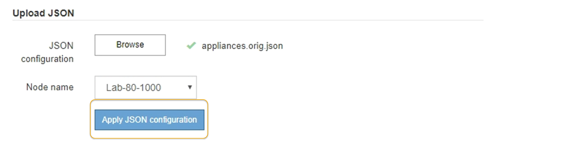

= Automate appliance configuration using StorageGRID Appliance Installer
:icons: font
:imagesdir: ../media/

[.lead]
You can automate the configuration of an appliance by using a JSON file that contains the configuration information. You upload the file using the StorageGRID Appliance Installer.

.What you'll need

* Your appliance must be on the latest firmware compatible with StorageGRID 11.5 or higher.
* You must be connected to the StorageGRID Appliance Installer on the appliance you are configuring using a xref:../admin/web-browser-requirements.adoc[supported web browser].

.About this task

You can automate appliance configuration tasks such as configuring the following:

* Grid Network, Admin Network, and Client Network IP addresses
* BMC interface
* Network links
 ** Port bond mode
 ** Network bond mode
 ** Link speed

Configuring your appliance using an uploaded JSON file is often more efficient than performing the configuration manually using multiple pages in the StorageGRID Appliance Installer, especially if you have to configure many nodes. You must apply the configuration file for each node one at a time.

NOTE: Experienced users who want to automate both the installation and configuration of their appliances can use the `configure-sga.py` script. +
xref:automating-installation-configuration-appliance-nodes-configure-sga-py-script.adoc[Automate installation and configuration of appliance nodes using configure-sga.py script]

.Steps

. Generate the JSON file using one of the following methods:
** The ConfigBuilder application
+
https://configbuilder.netapp.com/[ConfigBuilder.netapp.com^]

** The `configure-sga.py` appliance configuration script. You can download the script from StorageGRID Appliance Installer (*Help* > *Appliance Configuration Script*). See the instructions on automating the configuration using the configure-sga.py script.
+
xref:automating-installation-configuration-appliance-nodes-configure-sga-py-script.adoc[Automate installation and configuration of appliance nodes using configure-sga.py script]

+
The node names in the JSON file must follow these requirements:

 *** Must be a valid hostname containing at least 1 and no more than 32 characters
 *** Can use letters, numbers, and hyphens
 *** Cannot start or end with a hyphen
 *** Cannot contain only numbers
+
IMPORTANT: Ensure that the node names (the top-level names) in the JSON file are unique, or you will not be able to configure more than one node using the JSON file.
. Select *Advanced* > *Update Appliance Configuration*.
+
The Update Appliance Configuration page appears.
+

. Select the JSON file with the configuration you want to upload.
 .. Select *Browse*.
 .. Locate and select the file.
 .. Select *Open*.
+
The file is uploaded and validated. When the validation process is complete, the file name is shown next to a green check mark.
+
IMPORTANT: You might lose connection to the appliance if the configuration from the JSON file includes sections for "link_config", "networks", or both. If you are not reconnected within 1 minute, re-enter the appliance URL using one of the other IP addresses assigned to the appliance.
+

+
The *Node name* drop down is populated with the top-level node names defined in the JSON file.
+
NOTE: If the file is not valid, the file name is shown in red and an error message is displayed in a yellow banner. The invalid file is not applied to the appliance. You can use ConfigBuilder to ensure you have a valid JSON file.
. Select a node from the list in the *Node name* drop down.
+
The *Apply JSON configuration* button is enabled.
+

. Select *Apply JSON configuration*.
+
The configuration is applied to the selected node.
