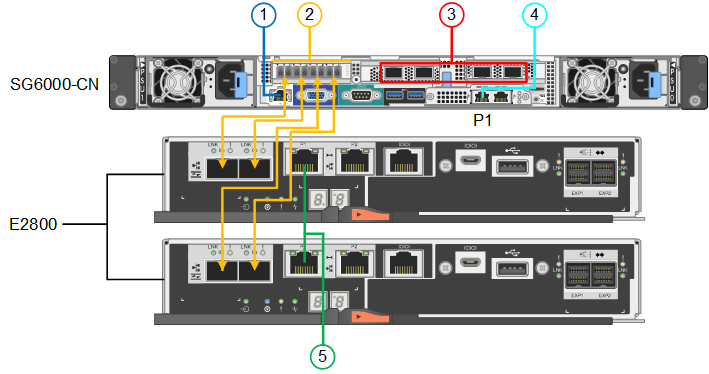
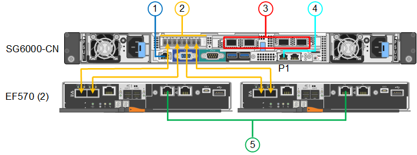

= Cabling the appliance (SG6000)
:icons: font
:imagesdir: ../media/

[.lead]
You must connect the storage controllers to the SG6000-CN controller, connect the management ports on all three controllers, and connect the network ports on the SG6000-CN controller to the Grid Network and optional Client Network for StorageGRID.

.What you'll need

* You have the four optical cables provided with the appliance for connecting the two storage controllers to the SG6000-CN controller.
* You have RJ-45 Ethernet cables (four minimum) for connecting the management ports.
* You have one of the following options for the network ports. These items are not provided with the appliance.
 ** One to four TwinAx cables for connecting the four network ports.
 ** One to four SFP+ or SFP28 transceivers if you plan to use optical cables for the ports.
+
CAUTION: *Risk of exposure to laser radiation* -- Do not disassemble or remove any part of an SFP transceiver. You might be exposed to laser radiation.

.About this task

The following figure shows the three controllers in the SG6060 appliance, with the SG6000-CN compute controller on the top and the two E2800 storage controllers on the bottom.

The following figure shows the three controllers in the SGF6024 appliance, with the SG6000-CN compute controller on the top and the two EF570 storage controllers side by side below the compute controller.

[options="header"]
|===
|  | Port| Type of port| Function
a|
1
a|
BMC management port on the SG6000-CN controller

a|
1-GbE (RJ-45)

a|
Connects to the network where you access the BMC interface.

a|
2
a|
FC connection ports:

* 4 on the SG6000-CN controller
* 2 on each storage controller

a|
16-Gb/s FC optical SFP+

a|
Connect each storage controller to the SG6000-CN controller.

a|
3
a|
Four network ports on the SG6000-CN controller
a|
10/25-GbE
a|
Connect to the Grid Network and the Client Network for StorageGRID.

a|
4
a|
Admin Network port on the SG6000-CN controller (labelled P1 in the figure)
a|
1-GbE (RJ-45)

*Important:* This port operates only at 1000 baseT/full and does not support 10- or 100-megabit speeds.

a|
Connects the SG6000-CN controller to the Admin Network for StorageGRID.

|
4
a|
Rightmost RJ-45 port on the SG6000-CN controller
a|
1-GbE (RJ-45)

*Important:* This port operates only at 1000 baseT/full and does not support 10- or 100-megabit speeds.

a|

* Can be bonded with management port 1 if you want a redundant connection to the Admin Network.
* Can be left unwired and available for temporary local access (IP 169.254.0.1).
* During installation, can be used to connect the SG6000-CN controller to a service laptop if DHCP-assigned IP addresses are not available.

a|
5
a|
Management port 1 on each storage controller

a|
1-GbE (RJ-45)
a|
Connects to the network where you access SANtricity System Manager.

a|
5
a|
Management port 2 on each storage controller

a|
1-GbE (RJ-45)
a|
Reserved for technical support.
|===

.Steps

. Connect the BMC management port on the SG6000-CN controller to the management network, using an Ethernet cable.
+
Although this connection is optional, it is recommended to facilitate support.

. Connect the two FC ports on each storage controller to the FC ports on the SG6000-CN controller, using four optical cables and four SFP+ transceivers for the storage controllers.
. Connect the network ports on the SG6000-CN controller to the appropriate network switches, using TwinAx cables or optical cables and SFP+ or SFP28 transceivers.
+
NOTE: The four network ports must use the same link speed. Install SFP+ transceivers if you plan to use 10-GbE link speeds. Install SFP28 transceivers if you plan to use 25-GbE link speeds.

 ** If you plan to use Fixed port bond mode (default), connect the ports to the StorageGRID Grid and Client Networks, as shown in the table.
+
[options="header"]
|===
| Port| Connects to...
a|
Port 1
a|
Client Network (optional)
a|
Port 2
a|
Grid Network
a|
Port 3
a|
Client Network (optional)
a|
Port 4
a|
Grid Network
|===

 ** If you plan to use the Aggregate port bond mode, connect one or more of the network ports to one or more switches. You should connect at least two of the four ports to avoid having a single point of failure. If you use more than one switch for a single LACP bond, the switches must support MLAG or equivalent.

. If you plan to use the Admin Network for StorageGRID, connect the Admin Network port on the SG6000-CN controller to the Admin Network, using an Ethernet cable.
. Connect management port 1 (P1) on each storage controller (the RJ-45 port on the left) to the management network for SANtricity System Manager, using an Ethernet cable.
+
Do not use management port 2 (P2) on the storage controllers (the RJ-45 port on the right). This port is reserved for technical support.

.Related information

xref:port-bond-modes-for-sg6000-cn-controller.adoc[Port bond modes for the SG6000-CN controller]

xref:reinstalling-sg6000-cn-controller-into-cabinet-or-rack.adoc[Reinstalling the SG6000-CN controller into a cabinet or rack]
