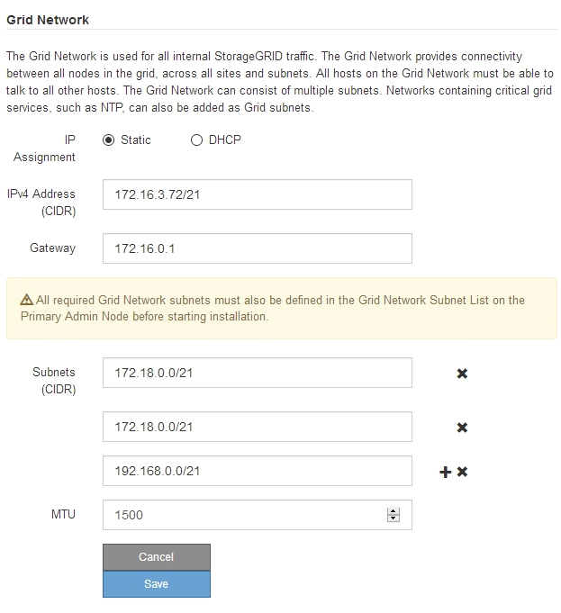

= Changing the MTU setting
:icons: font
:imagesdir: ../media/

[.lead]
You can change the MTU setting that you assigned when you configured IP addresses for the appliance node.

.What you'll need

The appliance has been placed maintenance mode.

xref:placing-appliance-into-maintenance-mode.adoc[Placing an appliance into maintenance mode]

.Steps

. From the StorageGRID Appliance Installer, select *Configure Networking* > *IP Configuration*.
. Make the desired changes to the MTU settings for the Grid Network, Admin Network, and Client Network.
+

+
IMPORTANT: The MTU value of the network must match the value configured on the switch port the node is connected to. Otherwise, network performance issues or packet loss might occur.
+
IMPORTANT: For the best network performance, all nodes should be configured with similar MTU values on their Grid Network interfaces. The *Grid Network MTU mismatch* alert is triggered if there is a significant difference in MTU settings for the Grid Network on individual nodes. The MTU values do not have to be the same for all network types.

. When you are satisfied with the settings, select *Save*.
. Reboot the node. From the StorageGRID Appliance Installer, select *Advanced* > *Reboot Controller*, and then select one of these options:
 ** Select *Reboot into StorageGRID* to reboot the controller with the node rejoining the grid. Select this option if you are done working in maintenance mode and are ready to return the node to normal operation.
 ** Select *Reboot into Maintenance Mode* to reboot the controller with the node remaining in maintenance mode. Select this option if there are additional maintenance operations you need to perform on the node before rejoining the grid.
image:../media/reboot_controller_from_maintenance_mode.png[Reboot controller in maintenance mode]
+
It can take up to 20 minutes for the appliance to reboot and rejoin the grid. To confirm that the reboot is complete and that the node has rejoined the grid, go back to the Grid Manager. The *Nodes* tab should display a normal status image:../media/icon_alert_green_checkmark.png[icon alert green checkmark] for the appliance node, indicating that no alerts are active and the node is connected to the grid.
+
image::../media/node_rejoin_grid_confirmation.png[Appliance node rejoined grid]

.Related information

xref:../admin/index.adoc[Administer StorageGRID]
