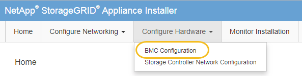
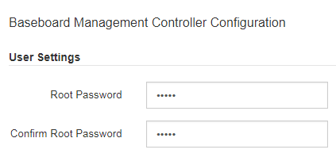

= Change root password for BMC interface
:icons: font
:imagesdir: ../media/

[.lead]
For security, you must change the password for the BMC's root user.

.What you'll need

* The management client is using a xref:../admin/web-browser-requirements.adoc[supported web browser].

.About this task

When you first install the appliance, the BMC uses a default password for the root user (`root/calvin`). You must change the password for the root user to secure your system.

.Steps

. From the client, enter the URL for the StorageGRID Appliance Installer: +
`*https://_Appliance_Controller_IP_:8443*`
+
For `_Appliance_Controller_IP_`, use the IP address for the appliance on any StorageGRID network.
+
The StorageGRID Appliance Installer Home page appears.

. Select *Configure Hardware* > *BMC Configuration*.
+

+
The Baseboard Management Controller Configuration page appears.

. Enter a new password for the root account in the two fields provided.
+

. Click *Save*.
