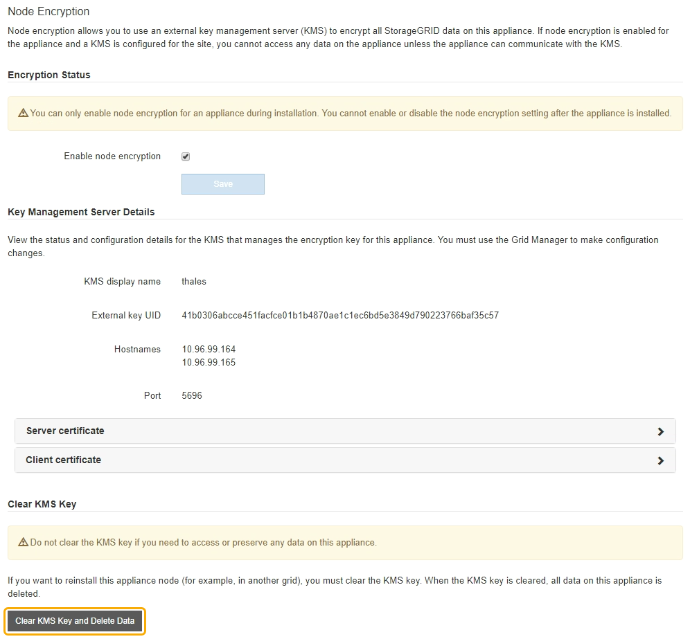
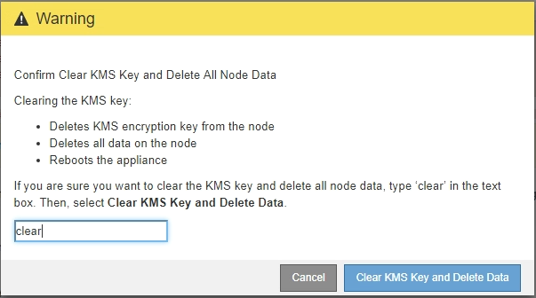

= Clearing the key management server configuration
:icons: font
:imagesdir: ../media/

[.lead]
Clearing the key management server (KMS) configuration disables node encryption on your appliance. After clearing the KMS configuration, the data on your appliance is permanently deleted and is no longer accessible. This data is not recoverable.

.What you'll need

If you need to preserve data on the appliance, you must perform a node decommission procedure before you clear the KMS configuration.

IMPORTANT: When KMS is cleared, data on the appliance will be permanently deleted and no longer accessible. This data is not recoverable.

Decommission the node to move any data it contains to other nodes in StorageGRID. See the recovery and maintenance instructions for grid node decommissioning.

.About this task

Clearing the appliance KMS configuration disables node encryption, removing the association between the appliance node and the KMS configuration for the StorageGRID site. Data on the appliance is then deleted and the appliance is left in a pre-install state. This process cannot be reversed.

You must clear the KMS configuration:

* Before you can install the appliance into another StorageGRID system, that does not use a KMS or that uses a different KMS.
+
IMPORTANT: Do not clear the KMS configuration if you plan to reinstall an appliance node in a StorageGRID system that uses the same KMS key.

* Before you can recover and reinstall a node where the KMS configuration was lost and the KMS key is not recoverable.
* Before returning any appliance that was previously in use at your site.
* After decommissioning a appliance that had node encryption enabled.

IMPORTANT: Decommission the appliance before clearing KMS to move its data to other nodes in your StorageGRID system. Clearing KMS before decommissioning the appliance will result in data loss and might render the appliance inoperable.

.Steps

. Open a browser, and enter one of the IP addresses for the appliance's compute controller. +
`*https://_Controller_IP_:8443*`
+
`_Controller_IP_` is the IP address of the compute controller (not the storage controller) on any of the three StorageGRID networks.
+
The StorageGRID Appliance Installer Home page appears.

. Select *Configure Hardware* > *Node Encryption*.
+

+
IMPORTANT: If the KMS configuration is cleared, data on the appliance will be permanently deleted. This data is not recoverable.

. At the bottom of the window, select *Clear KMS Key and Delete Data*.
. If you are sure that you want to clear the KMS configuration, type +
`*clear*` +
and select *Clear KMS Key and Delete Data*.
+

+
The KMS encryption key and all data are deleted from the node, and the appliance reboots. This can take up to 20 minutes.

. Open a browser, and enter one of the IP addresses for the appliance's compute controller. +
`*https://_Controller_IP_:8443*`
+
`_Controller_IP_` is the IP address of the compute controller (not the storage controller) on any of the three StorageGRID networks.
+
The StorageGRID Appliance Installer Home page appears.

. Select *Configure Hardware* > *Node Encryption*.
. Verify that node encryption is disabled and that the key and certificate information in *Key Management Server Details* and the *Clear KMS Key and Delete Data* control are removed from the window.
+
Node encryption cannot be reenabled on the appliance until it is reinstalled in a grid.

.After you finish

After the appliance reboots and you have verified that KMS has been cleared and that the appliance in a pre-install state, you can physically remove the appliance from your StorageGRID system. See the recovery and maintenance instructions for information about preparing an appliance for reinstallation.

.Related information

xref:../admin/index.adoc[Administer StorageGRID]

xref:../maintain/index.adoc[Maintain & recover]
