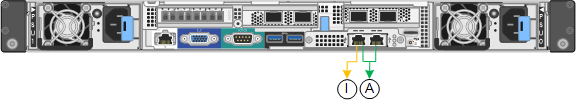
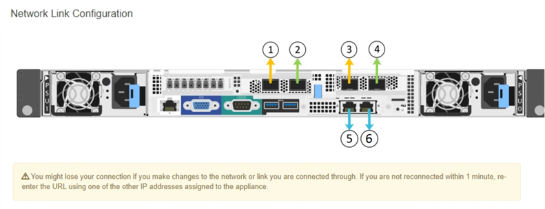
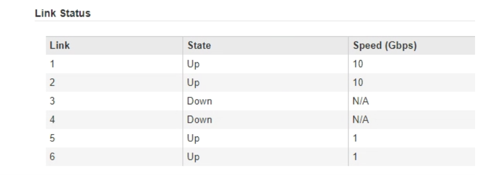
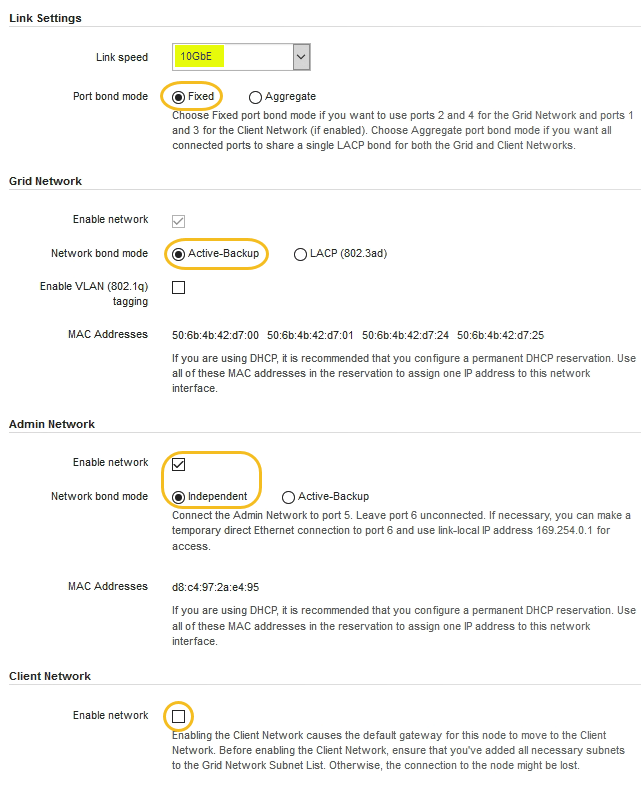
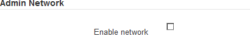

= Configuring network links (SG6000)
:icons: font
:imagesdir: ../media/

[.lead]
You can configure network links for the ports used to connect the appliance to the Grid Network, the Client Network, and the Admin Network. You can set the link speed as well as the port and network bond modes.

.What you'll need

If you are cloning an appliance node, configure network links for the target appliance for all links used by the source appliance node.

If you plan to use the 25-GbE link speed:

* You are using SFP28 TwinAx cables, or you have installed SFP28 transceivers in the network ports you plan to use.
* You have connected the network ports to switches that can support these features.
* You understand how to configure the switches to use this higher speed.

If you plan to use Aggregate port bond mode, LACP network bond mode, or VLAN tagging:

* You have connected the network ports on the appliance to switches that can support VLAN and LACP.
* If multiple switches are participating in the LACP bond, the switches support multi-chassis link aggregation groups (MLAG), or equivalent.
* You understand how to configure the switches to use VLAN, LACP, and MLAG or equivalent.
* You know the unique VLAN tag to use for each network. This VLAN tag will be added to each network packet to ensure that network traffic is routed to the correct network.

.About this task

This figure shows how the four network ports are bonded in fixed port bond mode (default configuration).

image::../media/sg6000_cn_fixed_port.gif[Image showing how the network ports on the SG6000-CN controller are bonded in fixed mode]

[options="header"]
|===
| Callout| Which ports are bonded
a|
C
a|
Ports 1 and 3 are bonded together for the Client Network, if this network is used.
a|
G
a|
Ports 2 and 4 are bonded together for the Grid Network.
|===
This figure shows how the four network ports are bonded in aggregate port bond mode.

image::../media/sg6000_cn_aggregate_port.gif[Image showing how the network ports on the SG6000-CN controller are bonded in aggregate mode]

[options="header"]
|===
| Callout| Which ports are bonded
a|
1
a|
All four ports are grouped in a single LACP bond, allowing all ports to be used for Grid Network and Client Network traffic.
|===
The table summarizes the options for configuring the four network ports. The default settings are shown in bold. You only need to configure the settings on the Link Configuration page if you want to use a non-default setting.

* *Fixed (default) port bond mode*
+
[options="header"]
|===
| Network bond mode| Client Network disabled (default)| Client Network enabled
a|
*Active-Backup (default)*
a|

 ** Ports 2 and 4 use an active-backup bond for the Grid Network.
 ** Ports 1 and 3 are not used.
 ** A VLAN tag is optional.

a|

 ** Ports 2 and 4 use an active-backup bond for the Grid Network.
 ** Ports 1 and 3 use an active-backup bond for the Client Network.
 ** VLAN tags can be specified for both networks for the convenience of the network administrator.

a|
LACP (802.3ad)
a|

 ** Ports 2 and 4 use an LACP bond for the Grid Network.
 ** Ports 1 and 3 are not used.
 ** A VLAN tag is optional.

a|

 ** Ports 2 and 4 use an LACP bond for the Grid Network.
 ** Ports 1 and 3 use an LACP bond for the Client Network.
 ** VLAN tags can be specified for both networks for the convenience of the network administrator.
|===

* *Aggregate port bond mode*
+
[options="header"]
|===
| Network bond mode| Client Network disabled (default)| Client Network enabled
a|
LACP (802.3ad) only
a|

 ** Ports 1-4 use a single LACP bond for the Grid Network.
 ** A single VLAN tag identifies Grid Network packets.

a|

 ** Ports 1-4 use a single LACP bond for the Grid Network and the Client Network.
 ** Two VLAN tags allow Grid Network packets to be segregated from Client Network packets.

|===

See "`Network port connections for the SG6000-CN controller`" for more information about port bond and network bond modes.

This figure shows how the two 1-GbE management ports on the SG6000-CN controller are bonded in Active-Backup network bond mode for the Admin Network.

.Steps

. From the StorageGRID Appliance Installer, click *Configure Networking* > *Link Configuration*.
+
The Network Link Configuration page displays a diagram of your appliance with the network and management ports numbered.
+

+
The Link Status table lists the link state (up/down) and speed (1/10/25/40/100 Gbps) of the numbered ports.
+

+
The first time you access this page:

 ** *Link Speed* is set to *10GbE*.
 ** *Port bond mode* is set to *Fixed*.
 ** *Network bond mode* is set to *Active-Backup* for the Grid Network.
 ** The *Admin Network* is enabled, and the network bond mode is set to *Independent*.
 ** The *Client Network* is disabled.
+

. If you plan to use the 25-GbE link speed for the network ports, select *25GbE* from the Link speed drop-down list.
+
The network switches you are using for the Grid Network and the Client Network must also support and be configured for this speed. You must use SFP28 TwinAx cables or optical cables and SFP28 transceivers.

. Enable or disable the StorageGRID networks you plan to use.
+
The Grid Network is required. You cannot disable this network.

 .. If the appliance is not connected to the Admin Network, unselect the *Enable network* check box for the Admin Network.
+

 .. If the appliance is connected to the Client Network, select the *Enable network* check box for the Client Network.
+
The Client Network settings for the network ports are now shown.

. Refer to the table, and configure the port bond mode and the network bond mode.
+
This example shows:

 ** *Aggregate* and *LACP* selected for the Grid and the Client networks. You must specify a unique VLAN tag for each network. You can select values between 0 and 4095.
 ** *Active-Backup* selected for the Admin Network.
+
image:../media/network_link_configuration_aggregate.gif[Screen shot showing Link Configuration settings for Aggregate mode]

. When you are satisfied with your selections, click *Save*.
+
NOTE: You might lose your connection if you made changes to the network or link you are connected through. If you are not reconnected within 1 minute, re-enter the URL for the StorageGRID Appliance Installer using one of the other IP addresses assigned to the appliance: +
`*https://_SG6000-CN_Controller_IP_:8443*`

.Related information

xref:port-bond-modes-for-sg6000-cn-controller.adoc[Port bond modes for the SG6000-CN controller]

xref:configuring-storagegrid-ip-addresses-sg6000.adoc[Configuring StorageGRID IP addresses]
