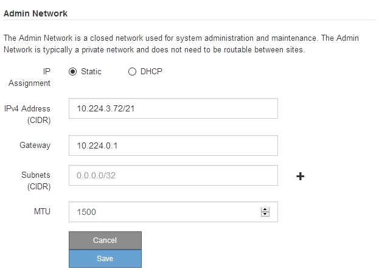
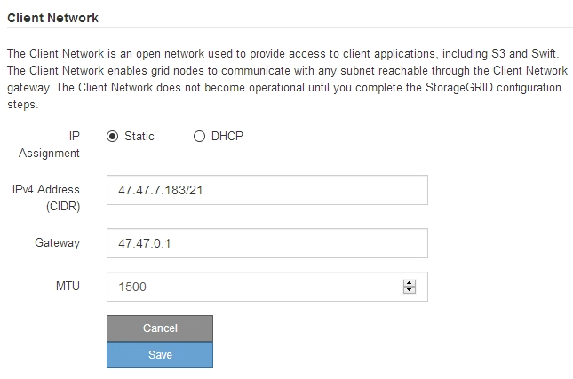

= Configuring StorageGRID IP addresses
:icons: font
:imagesdir: ../media/

[.lead]
You use the StorageGRID Appliance Installer to configure the IP addresses and routing information used for the appliance Storage Node on the StorageGRID Grid, Admin, and Client Networks.

.About this task

You must either assign a static IP for the appliance on each connected network or assign a permanent lease for the address on the DHCP server.

If you want to change the link configuration, see the instructions for changing the link configuration of the SG6000-CN controller.

.Steps

. In the StorageGRID Appliance Installer, select *Configure Networking* > *IP Configuration*.
+
The IP Configuration page appears.

. To configure the Grid Network, select either *Static* or *DHCP* in the *Grid Network* section of the page.
+
image::../media/grid_network_static.png[Grid Network IP]

. If you selected *Static*, follow these steps to configure the Grid Network:
 .. Enter the static IPv4 address, using CIDR notation.
 .. Enter the gateway.
+
If your network does not have a gateway, re-enter the same static IPv4 address.

 .. If you want to use jumbo frames, change the MTU field to a value suitable for jumbo frames, such as 9000. Otherwise, keep the default value of 1500.
+
IMPORTANT: The MTU value of the network must match the value configured on the switch port the node is connected to. Otherwise, network performance issues or packet loss might occur.
+
IMPORTANT: For the best network performance, all nodes should be configured with similar MTU values on their Grid Network interfaces. The *Grid Network MTU mismatch* alert is triggered if there is a significant difference in MTU settings for the Grid Network on individual nodes. The MTU values do not have to be the same for all network types.

 .. Click *Save*.
+
When you change the IP address, the gateway and list of subnets might also change.
+
If you lose your connection to the StorageGRID Appliance Installer, re-enter the URL using the new static IP address you just assigned. For example, +
`*https://_services_appliance_IP_:8443*`

 .. Confirm that the list of Grid Network subnets is correct.
+
If you have grid subnets, the Grid Network gateway is required. All grid subnets specified must be reachable through this gateway. These Grid Network subnets must also be defined in the Grid Network Subnet List on the primary Admin Node when you start StorageGRID installation.
+
NOTE: The default route is not listed. If the Client Network is not enabled, the default route will use the Grid Network gateway.

  *** To add a subnet, click the insert icon  to the right of the last entry.
  *** To remove an unused subnet, click the delete icon .

 .. Click *Save*.
. If you selected *DHCP*, follow these steps to configure the Grid Network:
 .. After you select the *DHCP* radio button, click *Save*.
+
The *IPv4 Address*, *Gateway*, and *Subnets* fields are automatically populated. If the DHCP server is set up to assign an MTU value, the *MTU* field is populated with that value, and the field becomes read-only.
+
Your web browser is automatically redirected to the new IP address for the StorageGRID Appliance Installer.

 .. Confirm that the list of Grid Network subnets is correct.
+
If you have grid subnets, the Grid Network gateway is required. All grid subnets specified must be reachable through this gateway. These Grid Network subnets must also be defined in the Grid Network Subnet List on the primary Admin Node when you start StorageGRID installation.
+
NOTE: The default route is not listed. If the Client Network is not enabled, the default route will use the Grid Network gateway.

  *** To add a subnet, click the insert icon  to the right of the last entry.
  *** To remove an unused subnet, click the delete icon .

 .. If you want to use jumbo frames, change the MTU field to a value suitable for jumbo frames, such as 9000. Otherwise, keep the default value of 1500.
+
IMPORTANT: The MTU value of the network must match the value configured on the switch port the node is connected to. Otherwise, network performance issues or packet loss might occur.
+
IMPORTANT: For the best network performance, all nodes should be configured with similar MTU values on their Grid Network interfaces. The *Grid Network MTU mismatch* alert is triggered if there is a significant difference in MTU settings for the Grid Network on individual nodes. The MTU values do not have to be the same for all network types.

 .. Click *Save*.
. To configure the Admin Network, select either *Static* or *DHCP* in the *Admin Network* section of the page.
+
NOTE: To configure the Admin Network, you must enable the Admin Network on the Link Configuration page.
+

. If you selected *Static*, follow these steps to configure the Admin Network:
 .. Enter the static IPv4 address, using CIDR notation, for Management Port 1 on the appliance.
+
Management Port 1 is the left of the two 1-GbE RJ45 ports on the right end of the appliance.

 .. Enter the gateway.
+
If your network does not have a gateway, re-enter the same static IPv4 address.

 .. If you want to use jumbo frames, change the MTU field to a value suitable for jumbo frames, such as 9000. Otherwise, keep the default value of 1500.
+
IMPORTANT: The MTU value of the network must match the value configured on the switch port the node is connected to. Otherwise, network performance issues or packet loss might occur.

 .. Click *Save*.
+
When you change the IP address, the gateway and list of subnets might also change.
+
If you lose your connection to the StorageGRID Appliance Installer, re-enter the URL using the new static IP address you just assigned. For example, +
`*https://_services_appliance_:8443*`

 .. Confirm that the list of Admin Network subnets is correct.
+
You must verify that all subnets can be reached using the gateway you provided.
+
NOTE: The default route cannot be made to use the Admin Network gateway.

  *** To add a subnet, click the insert icon  to the right of the last entry.
  *** To remove an unused subnet, click the delete icon .

 .. Click *Save*.
. If you selected *DHCP*, follow these steps to configure the Admin Network:
 .. After you select the *DHCP* radio button, click *Save*.
+
The *IPv4 Address*, *Gateway*, and *Subnets* fields are automatically populated. If the DHCP server is set up to assign an MTU value, the *MTU* field is populated with that value, and the field becomes read-only.
+
Your web browser is automatically redirected to the new IP address for the StorageGRID Appliance Installer.

 .. Confirm that the list of Admin Network subnets is correct.
+
You must verify that all subnets can be reached using the gateway you provided.
+
NOTE: The default route cannot be made to use the Admin Network gateway.

  *** To add a subnet, click the insert icon  to the right of the last entry.
  *** To remove an unused subnet, click the delete icon .

 .. If you want to use jumbo frames, change the MTU field to a value suitable for jumbo frames, such as 9000. Otherwise, keep the default value of 1500.
+
IMPORTANT: The MTU value of the network must match the value configured on the switch port the node is connected to. Otherwise, network performance issues or packet loss might occur.

 .. Click *Save*.
. To configure the Client Network, select either *Static* or *DHCP* in the *Client Network* section of the page.
+
NOTE: To configure the Client Network, you must enable the Client Network on the Link Configuration page.
+

. If you selected *Static*, follow these steps to configure the Client Network:
 .. Enter the static IPv4 address, using CIDR notation.
 .. Click *Save*.
 .. Confirm that the IP address for the Client Network gateway is correct.
+
NOTE: If the Client Network is enabled, the default route is displayed. The default route uses the Client Network gateway and cannot be moved to another interface while the Client Network is enabled.

 .. If you want to use jumbo frames, change the MTU field to a value suitable for jumbo frames, such as 9000. Otherwise, keep the default value of 1500.
+
IMPORTANT: The MTU value of the network must match the value configured on the switch port the node is connected to. Otherwise, network performance issues or packet loss might occur.

 .. Click *Save*.
. If you selected *DHCP*, follow these steps to configure the Client Network:
 .. After you select the *DHCP* radio button, click *Save*.
+
The *IPv4 Address* and *Gateway* fields are automatically populated. If the DHCP server is set up to assign an MTU value, the *MTU* field is populated with that value, and the field becomes read-only.
+
Your web browser is automatically redirected to the new IP address for the StorageGRID Appliance Installer.

 .. Confirm that the gateway is correct.
+
NOTE: If the Client Network is enabled, the default route is displayed. The default route uses the Client Network gateway and cannot be moved to another interface while the Client Network is enabled.

 .. If you want to use jumbo frames, change the MTU field to a value suitable for jumbo frames, such as 9000. Otherwise, keep the default value of 1500.
+
IMPORTANT: The MTU value of the network must match the value configured on the switch port the node is connected to. Otherwise, network performance issues or packet loss might occur.

.Related information

xref:changing-link-configuration-of-sg6000-cn-controller.adoc[Changing the link configuration of the SG6000-CN controller]
