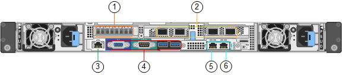
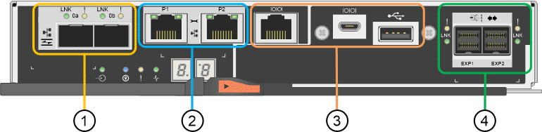
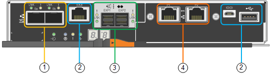
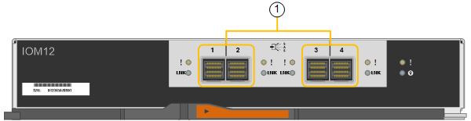

= Controllers in the SG6000 appliances
:icons: font
:imagesdir: ../media/

[.lead]
Each model of the StorageGRIDSG6000 appliance includes an SG6000-CN compute controller in a 1U enclosure and duplex E-Series storage controllers in a 2U or 4U enclosure, depending on the model. Review the diagrams to learn more about each type of controller.

== All appliances: SG6000-CN compute controller

* Provides compute resources for the appliance.
* Includes the StorageGRID Appliance Installer.
+
NOTE: StorageGRID software is not preinstalled on the appliance. This software is retrieved from the Admin Node when you deploy the appliance.

* Can connect to all three StorageGRID networks, including the Grid Network, the Admin Network, and the Client Network.
* Connects to the E-Series storage controllers and operates as the initiator.

This figure shows the connectors on the back of the SG6000-CN.

[options="header"]
|===
|  | Port| Type| Use
a|
1
a|
Interconnect ports 1-4
a|
16-Gb/s Fibre Channel (FC), with integrated optics
a|
Connect the SG6000-CN controller to the E2800 controllers (two connections to each E2800).
a|
2
a|
Network ports 1-4
a|
10-GbE or 25-GbE, based on cable or SFP transceiver type, switch speed, and configured link speed
a|
Connect to the Grid Network and the Client Network for StorageGRID.
a|
3
a|
BMC management port
a|
1-GbE (RJ-45)
a|
Connect to the SG6000-CN baseboard management controller.
a|
4
a|
Diagnostic and support ports
a|

* VGA
* Serial, 115200 8-N-1
* USB

a|
Reserved for technical support use.
a|
5
a|
Admin Network port 1
a|
1-GbE (RJ-45)
a|
Connect the SG6000-CN to the Admin Network for StorageGRID.
a|
6
a|
Admin Network port 2
a|
1-GbE (RJ-45)
a|
Options:

* Bond with management port 1 for a redundant connection to the Admin Network for StorageGRID.
* Leave unwired and available for temporary local access (IP 169.254.0.1).
* During installation, use port 2 for IP configuration if DHCP-assigned IP addresses are not available.

|===

== SG6060: E2800 storage controllers

* Two controllers for failover support.
* Manage the storage of data on the drives.
* Function as standard E-Series controllers in a duplex configuration.
* Include SANtricity OS Software (controller firmware).
* Include SANtricity System Manager for monitoring storage hardware and for managing alerts, the AutoSupport feature, and the Drive Security feature.
* Connect to the SG6000-CN controller and provide access to the storage.

This figure shows the connectors on the back of each of the E2800 controllers.

[options="header"]
|===
|  | Port| Type| Use
a|
1
a|
Interconnect ports 1 and 2
a|
16-Gb/s FC optical SFPa|
Connect each of the E2800 controllers to the SG6000-CN controller.

There are four connections to the SG6000-CN controller (two from each E2800).
a|
2
a|
Management ports 1 and 2
a|
1-Gb (RJ-45) Ethernet
a|

* Port 1 connects to the network where you access SANtricity System Manager on a browser.
* Port 2 is reserved for technical support use.

a|
3
a|
Diagnostic and support ports
a|

* RJ-45 serial port
* Micro USB serial port
* USB port

a|
Reserved for technical support use.
a|
4
a|
Drive expansion ports 1 and 2
a|
12Gb/s SAS
a|
Connect the ports to the drive expansion ports on the IOMs in the expansion shelf.
|===

== SGF6024: EF570 storage controllers

* Two controllers for failover support.
* Manage the storage of data on the drives.
* Function as standard E-Series controllers in a duplex configuration.
* Include SANtricity OS Software (controller firmware).
* Include SANtricity System Manager for monitoring storage hardware and for managing alerts, the AutoSupport feature, and the Drive Security feature.
* Connect to the SG6000-CN controller and provide access to the flash storage.

This figure shows the connectors on the back of each of the EF570 controllers.

[options="header"]
|===
|  | Port| Type| Use
a|
1
a|
Interconnect ports 1 and 2
a|
16-Gb/s FC optical SFPa|
Connect each of the EF570 controllers to the SG6000-CN controller.

There are four connections to the SG6000-CN controller (two from each EF570).
a|
2
a|
Diagnostic and support ports
a|

* RJ-45 serial port
* Micro USB serial port
* USB port

a|
Reserved for technical support use.
a|
3
a|
Drive expansion ports
a|
12Gb/s SAS
a|
Not used. The SGF6024 appliance does not support expansion drive shelves.
a|
4
a|
Management ports 1 and 2
a|
1-Gb (RJ-45) Ethernet
a|

* Port 1 connects to the network where you access SANtricity System Manager on a browser.
* Port 2 is reserved for technical support use.

|===

== SG6060: Input/output modules for optional expansion shelves

The expansion shelf contains two input/output modules (IOMs) that connect to the storage controllers or to other expansion shelves.

[options="header"]
|===
|  | Port| Type| Use
a|
1
a|
Drive expansion ports 1-4
a|
12Gb/s SAS
a|
Connect each port to the storage controllers or additional expansion shelf (if any).
|===
