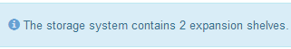
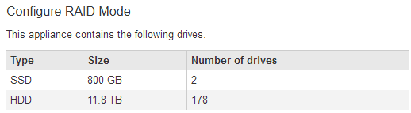

= Expansion shelves do not appear in Appliance Installer
:icons: font
:imagesdir: ../media/

[.lead]
If you have installed expansion shelves for the SG6060 and they do not appear in the StorageGRID Appliance Installer, you should verify that the shelves have been completely installed and powered on.

.About this task

You can verify that the expansion shelves are connected to the appliance by viewing the following information in the StorageGRID Appliance Installer:

* The *Home* page contains a message about expansion shelves.
+

* The *Advanced* > *RAID Mode* page indicates by number of drives whether or not the appliance includes expansion shelves. For example, in the following screen shot, two SSDs and 178 HDDs are shown. An SG6060 with two expansion shelves contains 180 total drives.

If the StorageGRID Appliance Installer pages do not indicate that expansion shelves are present, follow this procedure.

.Steps

. Verify that all required cables have been firmly connected.
. Verify that you have powered on the expansion shelves.
. If you need help resolving an issue, contact technical support.

.Related information

xref:sg6060-cabling-optional-expansion-shelves.adoc[SG6060: Cabling the optional expansion shelves]

xref:connecting-power-cords-and-applying-power-sg6000.adoc[Connecting power cords and applying power (SG6000)]
