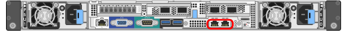
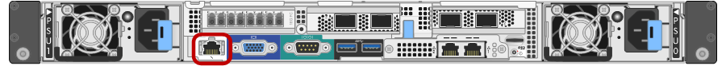

= Gathering installation information (SG6000)
:icons: font
:imagesdir: ../media/

[.lead]
As you install and configure the StorageGRID appliance, you must make decisions and gather information about Ethernet switch ports, IP addresses, and port and network bond modes.

.About this task

You can use the following tables to record the required information for each network you connect to the appliance. These values are required to install and configure the hardware.

== Information needed to connect to SANtricity System Manager on the storage controllers

You must connect both of the storage controllers in the appliance (either the E2800 controllers or the EF570 controllers) to the management network you will use for SANtricity System Manager. The controllers are located in each appliance as follows:

* SG6060: Controller A is on the top, and controller B is on the bottom.
* SGF6024: Controller A is on the left, and controller B is on the right.

[options="header"]
|===
| Information needed| Your value for controller A| Your value for controller B
a|
Ethernet switch port you will connect to management port 1 (labeled as P1 on the controller)
a|

a|

a|
MAC address for management port 1 (printed on a label near port P1)
a|

a|

a|
DHCP-assigned IP address for management port 1, if available after power on

*Note:* If the network you will connect to the storage controller includes a DHCP server, the network administrator can use the MAC address to determine the IP address that was assigned by the DHCP server.

a|

a|

a|
Static IP address you plan to use for the appliance on the management network
a|
For IPv4:

* IPv4 address:
* Subnet mask:
* Gateway:

For IPv6:

* IPv6 address:
* Routable IP address:
* storage controller router IP address:

a|
For IPv4:

* IPv4 address:
* Subnet mask:
* Gateway:

For IPv6:

* IPv6 address:
* Routable IP address:
* storage controller router IP address:

a|
IP address format
a|
Choose one:

* IPv4
* IPv6

a|
Choose one:

* IPv4
* IPv6

a|
Speed and duplex mode

*Note:* You must make sure the Ethernet switch for the SANtricity System Manager management network is set to autonegotiate.

a|
Must be:

* Autonegotiate (default)

a|
Must be:

* Autonegotiate (default)

[options="header"]
|===

== Information needed to connect the SG6000-CN controller to the Admin Network

The Admin Network for StorageGRID is an optional network, used for system administration and maintenance. The appliance connects to the Admin Network using the following 1-GbE management ports on the SG6000-CN controller.

[options="header"]
|===
| Information needed| Your value
a|
Admin Network enabled
a|
Choose one:

* No
* Yes (default)

a|
Network bond mode
a|
Choose one:

* Independent (default)
* Active-Backup

a|
Switch port for the left port in the red circle in the diagram (default active port for Independent network bond mode)
a|

a|
Switch port for the right port in the red circle in the diagram (Active-Backup network bond mode only)
a|

a|
MAC address for the Admin Network port

*Note:* The MAC address label on the front of the SG6000-CN controller lists the MAC address for the BMC management port. To determine the MAC address for the Admin Network port, you must add *2* to the hexadecimal number on the label. For example, if the MAC address on the label ends in *09*, the MAC address for the Admin Port would end in *0B*. If the MAC address on the label ends in *(_y_)FF*, the MAC address for the Admin Port would end in *(_y_+1)01*. You can easily make this calculation by opening Calculator in Windows, setting it to Programmer mode, selecting Hex, typing the MAC address, then typing *+ 2 =*.

a|

a|
DHCP-assigned IP address for the Admin Network port, if available after power on

*Note:* You can determine the DHCP-assigned IP address by using the MAC address to look up the assigned IP.

a|

* IPv4 address (CIDR):
* Gateway:

a|
Static IP address you plan to use for the appliance Storage Node on the Admin Network

*Note:* If your network does not have a gateway, specify the same static IPv4 address for the gateway.

a|

* IPv4 address (CIDR):
* Gateway:

a|
Admin Network subnets (CIDR)
a|
|===

== Information needed to connect and configure the 10/25-GbE ports on the SG6000-CN controller

The four 10/25-GbE ports on the SG6000-CN controller connect to the StorageGRID Grid Network and the optional Client Network.

[options="header"]
|===
| Information needed| Your value
a|
Link speed

a|
Choose one:

* Auto (default)
* 10 GbE
* 25 GbE

a|
Port bond mode

a|
Choose one:

* Fixed (default)
* Aggregate

a|
Switch port for port 1 (Client Network for Fixed mode)

a|

a|
Switch port for port 2 (Grid Network for Fixed mode)

a|

a|
Switch port for port 3 (Client Network for Fixed mode)

a|

a|
Switch port for port 4 (Grid Network for Fixed mode)

a|

|===

== Information needed to connect the SG6000-CN controller to the Grid Network

The Grid Network for StorageGRID is a required network, used for all internal StorageGRID traffic. The appliance connects to the Grid Network using the 10/25-GbE ports on the SG6000-CN controller.

[options="header"]
|===
| Information needed| Your value
a|
Network bond mode
a|
Choose one:

* Active-Backup (default)
* LACP (802.3ad)

a|
VLAN tagging enabled
a|
Choose one:

* No (default)
* Yes

a|
VLAN tag(if VLAN tagging is enabled)

a|
Enter a value between 0 and 4095:
a|
DHCP-assigned IP address for the Grid Network, if available after power on
a|

* IPv4 address (CIDR):
* Gateway:

a|
Static IP address you plan to use for the appliance Storage Node on the Grid Network

*Note:* If your network does not have a gateway, specify the same static IPv4 address for the gateway.

a|

* IPv4 address (CIDR):
* Gateway:

a|
Grid Network subnets (CIDRs)
a|

|===

== Information needed to connect the SG6000-CN controller to the Client Network

The Client Network for StorageGRID is an optional network, typically used to provide client protocol access to the grid. The appliance connects to the Client Network using the 10/25-GbE ports on the SG6000-CN controller.

[options="header"]
|===
| Information needed| Your value
a|
Client Network enabled
a|
Choose one:

* No (default)
* Yes

a|
Network bond mode
a|
Choose one:

* Active-Backup (default)
* LACP (802.3ad)

a|
VLAN tagging enabled
a|
Choose one:

* No (default)
* Yes

a|
VLAN tag(If VLAN tagging is enabled)

a|
Enter a value between 0 and 4095:

a|
DHCP-assigned IP address for the Client Network, if available after power on
a|

* IPv4 address (CIDR):
* Gateway:

a|
Static IP address you plan to use for the appliance Storage Node on the Client Network

*Note:* If the Client Network is enabled, the default route on the controller will use the gateway specified here.

a|

* IPv4 address (CIDR):
* Gateway:

|===

== Information needed to connect the SG6000-CN controller to the BMC management network

You can access the BMC interface on the SG6000-CN controller using the following 1-GbE management port. This
port supports remote management of the controller hardware over Ethernet using the Intelligent Platform Management
Interface (IPMI) standard.

[options="header"]
|===
| Information needed| Your value
a|
Ethernet switch port you will connect to the BMC management port (circled in the diagram)
a|

a|
DHCP-assigned IP address for the BMC management network, if available after power on
a|

* IPv4 address (CIDR):
* Gateway:

a|
Static IP address you plan to use for the BMC management port
a|

* IPv4 address (CIDR):
* Gateway:

|===

.Related information

xref:controllers-in-sg6000-appliances.adoc[Controllers in the SG6000 appliances]

xref:reviewing-appliance-network-connections-sg6000.adoc[Reviewing appliance network connections]

xref:port-bond-modes-for-sg6000-cn-controller.adoc[Port bond modes for the SG6000-CN controller]

xref:cabling-appliance-sg6000.adoc[Cabling the appliance (SG6000)]

xref:configuring-storagegrid-ip-addresses-sg6000.adoc[Configuring StorageGRID IP addresses]
