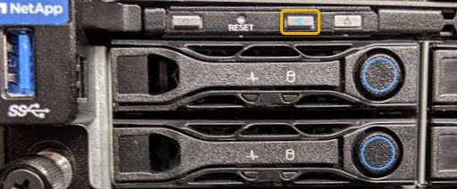

= Locating the controller in a data center
:icons: font
:imagesdir: ../media/

[.lead]
Locate the controller so that you can perform hardware maintenance or upgrades.

.What you'll need

* You have determined which controller requires maintenance.
+
(Optional) To help locate the controller in your data center, turn on the blue identify LED.
+
xref:turning-controller-identify-led-on-and-off.adoc[Turning the controller identify LED on and off]

.Steps

. Find the controller requiring maintenance in the data center.
 ** Look for a lit blue identify LED on the front or rear of the controller.
+
The front identify LED is behind the controller front bezel and might be difficult to see if the bezel is installed.
+

 ** Check the tags attached to the front of each controller for a matching part number.
. Remove the controller front bezel, if one is installed, to access the front panel controls and indicators.
. Optional: Turn off the blue identify LED if you used it to locate the controller.
 ** Press the identify LED switch on the controller front panel.
 ** Use the controller BMC interface.
+
xref:turning-controller-identify-led-on-and-off.adoc[Turning the controller identify LED on and off]

.Related information

xref:removing-fibre-channel-hba.adoc[Removing the Fibre Channel HBA]

xref:removing-sg6000-cn-controller-from-cabinet-or-rack.adoc[Removing the SG6000-CN controller from a cabinet or rack]

xref:shutting-down-sg6000-cn-controller.adoc[Shutting down the SG6000-CN controller]
