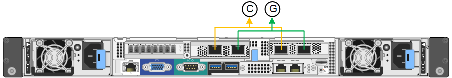
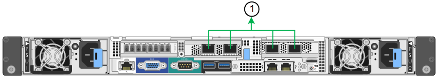

= Network bond modes for the 10/25-GbE ports
:icons: font
:imagesdir: ../media/

[.lead]
The 10/25-GbE networking ports on the SG6000-CN controller support Fixed port bond mode or Aggregate port bond mode for the Grid Network and Client Network connections.

== Fixed port bond mode

Fixed mode is the default configuration for the 10/25-GbE networking ports.

[options="header"]
|===
| Callout| Which ports are bonded
a|
C
a|
Ports 1 and 3 are bonded together for the Client Network, if this network is used.
a|
G
a|
Ports 2 and 4 are bonded together for the Grid Network.
|===
When using Fixed port bond mode, the ports can be bonded using active-backup mode or Link Aggregation Control Protocol mode (LACP 802.3ad).

* In active-backup mode (default), only one port is active at a time. If the active port fails, its backup port automatically provides a failover connection. Port 4 provides a backup path for port 2 (Grid Network), and port 3 provides a backup path for port 1 (Client Network).
* In LACP mode, each pair of ports forms a logical channel between the controller and the network, allowing for higher throughput. If one port fails, the other port continues to provide the channel. Throughput is reduced, but connectivity is not impacted.

NOTE: If you do not need redundant connections, you can use only one port for each network. However, be aware that an alert will be triggered in the Grid Manager after StorageGRID is installed, indicating that the link is down. Because this port is disconnected on purpose, you can safely disable this alert.

From the Grid Manager, select *Alert* > *Rules*, select the rule, and click *Edit rule*. Then, uncheck the *Enabled* check box.

== Aggregate port bond mode

Aggregate port bond mode significantly increases the throughout for each StorageGRID network and provides additional failover paths.

[options="header"]
|===
| Callout| Which ports are bonded
a|
1
a|
All connected ports are grouped in a single LACP bond, allowing all ports to be used for Grid Network and Client Network traffic.
|===
If you plan to use aggregate port bond mode:

* You must use LACP network bond mode.
* You must specify a unique VLAN tag for each network. This VLAN tag will be added to each network packet to ensure that network traffic is routed to the correct network.
* The ports must be connected to switches that can support VLAN and LACP. If multiple switches are participating in the LACP bond, the switches must support multi-chassis link aggregation groups (MLAG), or equivalent.
* You must understand how to configure the switches to use VLAN, LACP, and MLAG, or equivalent.

If you do not want to use all four 10/25-GbE ports, you can use one, two, or three ports. Using more than one port maximizes the chance that some network connectivity will remain available if one of the 10/25-GbE ports fails.

NOTE: If you choose to use fewer than four ports, be aware that one or more alarms will be raised in the Grid Manager after StorageGRID is installed, indicating that cables are unplugged. You can safely acknowledge the alarms to clear them.
