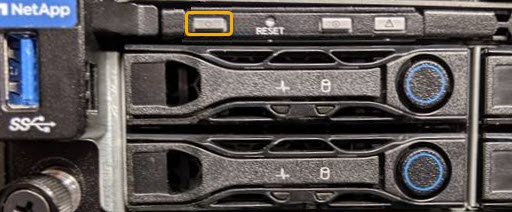
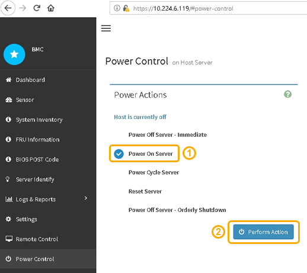

= Powering on the SG6000-CN controller and verifying operation
:icons: font
:imagesdir: ../media/

[.lead]
Power on the controller after completing maintenance.

.What you'll need

* You have installed the controller in a cabinet or rack and connected the data and power cables.
+
xref:reinstalling-sg6000-cn-controller-into-cabinet-or-rack.adoc[Reinstalling the SG6000-CN controller into a cabinet or rack]

* You have physically located the controller in the data center.
+
xref:locating-controller-in-data-center.adoc[Locating the controller in a data center]

.Steps

. Power on the SG6000-CN controller and monitor the controller LEDs and boot-up codes using one of the following methods:
 ** Press the power switch on the front of the controller.
+

 ** Use the controller BMC interface:
  ... Access the controller BMC interface.
+
xref:accessing-bmc-interface-sg6000.adoc[Accessing the BMC interface]

  ... Select *Power Control*.
  ... Select *Power On Server* and then select *Perform Action*.
+

+
Use the BMC interface to monitor start-up status.
. Confirm that the appliance controller displays in the Grid Manager and with no alerts.
+
It might take up to 20 minutes for the controller to display in the Grid Manager.

. Confirm that the new SG6000-CN controller is fully operational:
 .. Log in to the grid node using PuTTY or another ssh client:
  ... Enter the following command: `ssh admin@_grid_node_IP_`
  ... Enter the password listed in the `Passwords.txt` file.
  ... Enter the following command to switch to root: `su -`
  ... Enter the password listed in the `Passwords.txt` file.
+
When you are logged in as root, the prompt changes from `$` to `#`.
 .. Enter the following command and verify that it returns the expected output: +
 `cat /sys/class/fc_host/*/port_state`
+
Expected output:
+
----
Online
Online
Online
----
+
If the expected output is not returned, contact technical support.

 .. Enter the following command and verify that it returns the expected output: +
 `cat /sys/class/fc_host/*/speed`
+
Expected output:
+
----
16 Gbit
16 Gbit
16 Gbit16 Gbit
16 Gbit
----
+
If the expected output is not returned, contact technical support.

 .. From the Nodes page in Grid Manager, make sure that the appliance node is connected to the grid and does not have any alerts.
+
CAUTION: Do not take another appliance node offline unless this appliance has a green icon.
. Optional: Install the front bezel, if one was removed.

.Related information

xref:viewing-status-indicators-and-buttons-on-sg6000-cn-controller.adoc[Viewing status indicators and buttons on the SG6000-CN controller]

xref:viewing-boot-up-status-codes-for-sg6000-storage-controllers.adoc[Viewing boot-up status codes for the SG6000 storage controllers]
