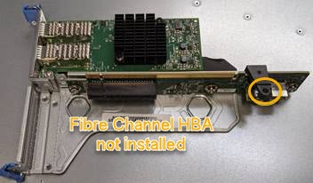

= Reinstalling the Fibre Channel HBA
:icons: font
:imagesdir: ../media/

[.lead]
The replacement Fibre Channel HBA is installed into the same location as the one that was removed.

.What you'll need

* You have the correct replacement Fibre Channel HBA.
* You have removed the existing Fibre Channel HBA.
+
xref:removing-fibre-channel-hba.adoc[Removing the Fibre Channel HBA]

.Steps

. Wrap the strap end of the ESD wristband around your wrist, and secure the clip end to a metal ground to prevent static discharge.
. Remove the replacement Fibre Channel HBA from its packaging.
. With the blue adapter latch in the open position, align the Fibre Channel HBA with its connector on the riser assembly; then, carefully press the adapter into the connector until it is fully seated.
+
image::../media/sg6060_fc_hba_location.jpg[SG6060 Fibre Channel HBA in riser assembly]
+
There are two adapters in the riser assembly: a Fibre Channel HBA and an Ethernet network adapter. The Fibre Channel HBA is indicated in the illustration.

. Locate the alignment hole on the riser assembly (circled) that aligns with a guide pin on the system board to ensure correct riser assembly positioning.
+

. Position the riser assembly in the chassis, making sure that it aligns with the connector and guide pin on the system board; then, insert the riser assembly.
. Carefully press the riser assembly in place along its center line, next to the blue-marked holes, until it is fully seated.
. Remove the protective caps from the Fibre Channel HBA ports where you will be reinstalling cables.

.After you finish

If you have no other maintenance procedures to perform in the controller, reinstall the controller cover.

xref:reinstalling-sg6000-cn-controller-cover.adoc[Reinstalling the SG6000-CN controller cover]
