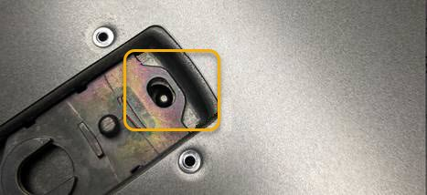

= Reinstalling the SG6000-CN controller cover
:icons: font
:imagesdir: ../media/

[.lead]
Reinstall the controller cover when internal hardware maintenance is complete.

.What you'll need

You have completed all maintenance procedures inside the controller.

.Steps

. With the cover latch open, hold the cover above the chassis and align the hole in the top cover latch with the pin in the chassis. When the cover is aligned, lower it onto the chassis.
+

. Rotate the cover latch forward and down until it stops and the cover fully seats into the chassis. Verify that there are no gaps along the front edge of the cover.
+
If the cover is not fully seated, you might not be able to slide the SG6000-CN controller into the rack.

. Optional: Turn the blue plastic latch lock one-quarter turn in the lock direction, as shown on the latch lock, to lock it.

.After you finish

Reinstall the controller in the cabinet or rack.

xref:reinstalling-sg6000-cn-controller-into-cabinet-or-rack.adoc[Reinstalling the SG6000-CN controller into a cabinet or rack]
