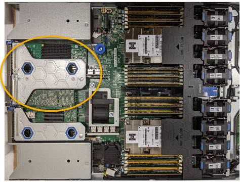
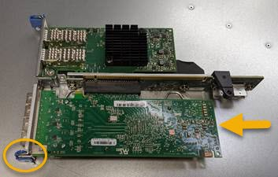

= Removing the Fibre Channel HBA
:icons: font
:imagesdir: ../media/

[.lead]
You might need to replace the Fibre Channel host bus adapter (HBA) in the SG6000-CN controller if it is not functioning optimally or if it has failed.

.What you'll need

* You have the correct replacement Fibre Channel HBA.
* You have determined which SG6000-CN controller contains the Fibre Channel HBA to replace.
+
xref:verifying-fibre-channel-hba-to-replace.adoc[Verifying the Fibre Channel HBA to replace]

* You have physically located the SG6000-CN controller where you are replacing the Fibre Channel HBA in the data center.
+
xref:locating-controller-in-data-center.adoc[Locating the controller in a data center]

* You have removed the controller cover.
+
xref:removing-sg6000-cn-controller-cover.adoc[Removing the SG6000-CN controller cover]

.About this task

To prevent service interruptions, confirm that all other Storage Nodes are connected to the grid before starting the Fibre Channel HBA replacement or replace the adapter during a scheduled maintenance window when periods of service disruption are normally expected. See the information about determining node connection states in the instructions for managing objects with information lifecycle management.

IMPORTANT: If you have ever used an ILM rule that creates only one copy of an object, you must replace the Fibre Channel HBA during a scheduled maintenance window. Otherwise, you might temporarily lose access to those objects during this procedure. +
See information about managing objects with information lifecycle management.

.Steps

. Wrap the strap end of the ESD wristband around your wrist, and secure the clip end to a metal ground to prevent static discharge.
. Locate the riser assembly at the rear of the controller that contains the Fibre Channel HBA.
+

. Grasp the riser assembly through the blue-marked holes and carefully lift it upwards. Move the riser assembly toward the front of the chassis as you lift it to allow the external connectors in its installed adapters to clear the chassis.
. Place the riser card on a flat anti-static surface with the metal frame side down to access the adapters.
+

+
There are two adapters in the riser assembly: a Fibre Channel HBA and an Ethernet network adapter. The Fibre Channel HBA is indicated in the illustration.

. Open the blue adapter latch (circled) and carefully remove the Fibre Channel HBA from the riser assembly. Rock the adapter slightly to help remove the adapter from its connector. Do not use excessive force.
. Place the adapter on a flat anti-static surface.

.After you finish

Install the replacement Fibre Channel HBA.

xref:reinstalling-fibre-channel-hba.adoc[Reinstalling the Fibre Channel HBA]

.Related information

xref:reinstalling-fibre-channel-hba.adoc[Reinstalling the Fibre Channel HBA]

xref:../admin/index.adoc[Administer StorageGRID]

xref:../monitor/index.adoc[Monitor & troubleshoot]

xref:../ilm/index.adoc[Manage objects with ILM]
