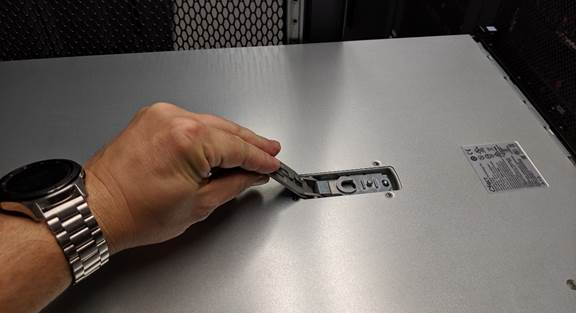

= Removing the SG6000-CN controller cover
:icons: font
:imagesdir: ../media/

[.lead]
Remove the controller cover to access internal components for maintenance.

.What you'll need

Remove the controller from the cabinet or rack to access the top cover.

xref:removing-sg6000-cn-controller-from-cabinet-or-rack.adoc[Removing the SG6000-CN controller from a cabinet or rack]

.Steps

. Make sure that the SG6000-CN controller cover latch is not locked. If necessary, turn the blue plastic latch lock one-quarter turn in the unlock direction, as shown on the latch lock.
. Rotate the latch up and back toward the rear of the SG6000-CN controller chassis until it stops; then, carefully lift the cover from the chassis and set it aside.
+

+
IMPORTANT: Wrap the strap end of an ESD wristband around your wrist and secure the clip end to a metal ground to prevent static discharge when working inside the SG6000-CN controller.

.Related information

xref:removing-fibre-channel-hba.adoc[Removing the Fibre Channel HBA]
