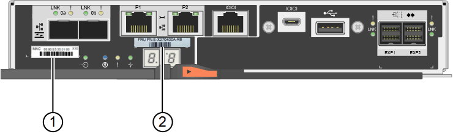
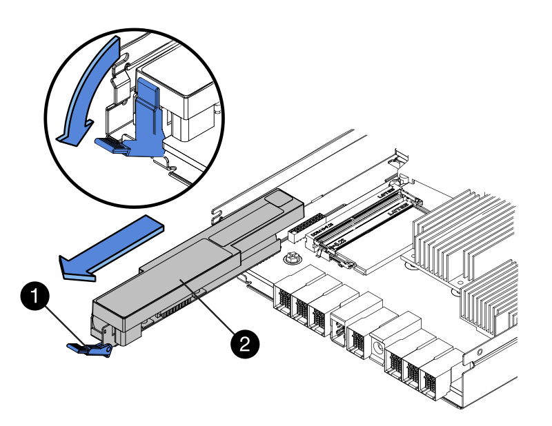
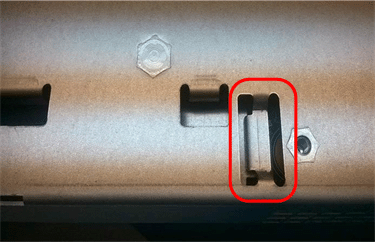

= Replacing a storage controller
:icons: font
:imagesdir: ../media/

[.lead]
You might need to replace an E2800 controller or an EF570 controller if it is not functioning optimally or if it has failed.

.What you'll need

* You have a replacement controller with the same part number as the controller you are replacing.
* You have labels to identify each cable that is connected to the controller.
* You have an ESD wristband, or you have taken other antistatic precautions.
* You have a #1 Phillips screwdriver.
* You have the E-Series instructions for replacing a controller in duplex configuration.
+
IMPORTANT: Refer to the E-Series instructions only when directed or if you need more details to perform a specific step. Do not rely on the E-Series instructions to replace a controller in the StorageGRID appliance, because the procedures are not the same.

* You have physically located the storage appliance where you are replacing the controller in the data center.
+
xref:locating-controller-in-data-center.adoc[Locating the controller in a data center]

.About this task

You can determine if you have a failed controller in two ways:

* The Recovery Guru in SANtricity System Manager directs you to replace the controller.
* The amber Attention LED on the controller is on, indicating that the controller has a fault.
+
IMPORTANT: If both controllers in the shelf have their Attention LEDs on, contact technical support for assistance.

Because the storage controller shelf contains two storage controllers, you can replace one of the controllers while your appliance is powered on and performing read/write operations, as long as the following conditions are true:

* The second controller in the shelf has Optimal status.
* The "`OK to remove`" field in the Details area of the Recovery Guru in SANtricity System Manager displays Yes, indicating that it is safe to remove this component.

IMPORTANT: If the second controller canister in the shelf does not have Optimal status or if the Recovery Guru indicates that it is not OK to remove the controller canister, contact technical support.

When you replace a controller, you must remove the battery from the original controller and install it in the replacement controller.

NOTE: The storage controllers in the appliance do not include host interface cards (HIC).

.Steps

. Unpack the new controller, and set it on a flat, static-free surface.
+
Save the packing materials to use when shipping the failed controller.

. Locate the MAC address and FRU part number labels on the back of the replacement controller.
+
This figure shows the E2800 controller. The procedure for replacing the EF570 controller is identical.
+

+
[options="header"]
|===
| Label| Label| Description
a|
1
a|
MAC address
a|
The MAC address for management port 1 ("`P1`"). If you used DHCP to obtain the original controller's IP address, you will need this address to connect to the new controller.
a|
2
a|
FRU part number
a|
The FRU part number. This number must match the replacement part number for the currently installed controller.
|===

. Prepare to remove the controller.
+
You use SANtricity System Manager to perform these steps. As needed for additional details, reference the E-Series instructions for replacing the storage controller.

 .. Confirm that the replacement part number for the failed controller is the same as the FRU part number for the replacement controller.
+
When a controller has a fault and needs to be replaced, the replacement part number is displayed in the Details area of the Recovery Guru. If you need to find this number manually, you can look on the *Base* tab for the controller.
+
IMPORTANT: *Possible loss of data access --* If the two part numbers are not the same, do not attempt this procedure.

 .. Back up the configuration database.
+
If a problem occurs when you remove a controller, you can use the saved file to restore your configuration.

 .. Collect support data for the appliance.
+
NOTE: Collecting support data before and after replacing a component ensures you can send a full set of logs to technical support in case the replacement does not resolve the problem.

 .. Take the controller you plan to replace offline.

. Remove the controller from the appliance:
 .. Put on an ESD wristband or take other antistatic precautions.
 .. Label the cables and then disconnect the cables and SFPs.
+
IMPORTANT: To prevent degraded performance, do not twist, fold, pinch, or step on the cables.

 .. Release the controller from the appliance by squeezing the latch on the cam handle until it releases, and then open the cam handle to the right.
 .. Using two hands and the cam handle, slide the controller out of the appliance.
+
IMPORTANT: Always use two hands to support the weight of the controller.

 .. Place the controller on a flat, static-free surface with the removable cover facing up.
 .. Remove the cover by pressing down on the button and sliding the cover off.
. Remove the battery from the failed controller, and install it into the replacement controller:
 .. Confirm that the green LED inside the controller (between the battery and the DIMMs) is off.
+
If this green LED is on, the controller is still using battery power. You must wait for this LED to go off before removing any components.
+
image::../media/e2800_internal_cache_active_led.gif[Green LED on E2800]
+
[options="header"]
|===
| Item| Description
a|

a|
Internal Cache Active LED
a|

a|
Battery
|===

 .. Locate the blue release latch for the battery.
 .. Unlatch the battery by pushing the release latch down and away from the controller.
+

+
[options="header"]
|===
| Item| Description
a|

a|
Battery release latch
a|

a|
Battery
|===

 .. Lift up on the battery, and slide it out of the controller.
 .. Remove the cover from the replacement controller.
 .. Orient the replacement controller so that the slot for the battery faces toward you.
 .. Insert the battery into the controller at a slight downward angle.
+
You must insert the metal flange at the front of the battery into the slot on the bottom of the controller, and slide the top of the battery beneath the small alignment pin on the left side of the controller.

 .. Move the battery latch up to secure the battery.
+
When the latch clicks into place, the bottom of the latch hooks into a metal slot on the chassis.

 .. Turn the controller over to confirm that the battery is installed correctly.
+
IMPORTANT: *Possible hardware damage* -- The metal flange at the front of the battery must be completely inserted into the slot on the controller (as shown in the first figure). If the battery is not installed correctly (as shown in the second figure), the metal flange might contact the controller board, causing damage.

  *** *Correct -- The battery's metal flange is completely inserted in the slot on the controller:*
+
image::../media/e2800_battery_flange_ok.gif[Battery Flange Correct]

  *** *Incorrect -- The battery's metal flange is not inserted into the slot on the controller:*
+

 .. Replace the controller cover.
. Install the replacement controller into the appliance.
 .. Turn the controller over, so that the removable cover faces down.
 .. With the cam handle in the open position, slide the controller all the way into the appliance.
 .. Move the cam handle to the left to lock the controller in place.
 .. Replace the cables and SFPs.
 .. If the original controller used DHCP for the IP address, locate the MAC address on the label on the back of the replacement controller. Ask your network administrator to associate the DNS/network and IP address for the controller you removed with the MAC address for the replacement controller.
+
NOTE: If the original controller did not use DHCP for the IP address, the new controller will adopt the IP address of the controller you removed.
. Bring the controller online using SANtricity System Manager:
 .. Select *Hardware*.
 .. If the graphic shows the drives, select *Show back of shelf*.
 .. Select the controller you want to place online.
 .. Select *Place Online* from the context menu, and confirm that you want to perform the operation.
 .. Verify that the seven-segment display shows a state of `99`.
. Confirm that the new controller is Optimal, and collect support data.

.Related information

http://mysupport.netapp.com/info/web/ECMP1658252.html[NetApp E-Series Systems Documentation Site^]
