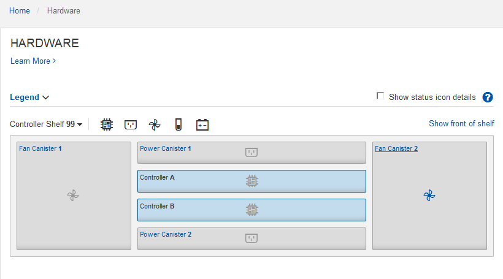

= Review hardware status in SANtricity System Manager
:icons: font
:imagesdir: ../media/

[.lead]
You can use SANtricity System Manager to monitor and manage the individual hardware components in the storage controller shelf and to review hardware diagnostic and environmental information, such as component temperatures, as well as issues related to the drives.

.What you'll need

* You are using a xref:../admin/web-browser-requirements.adoc[supported web browser].
* To access SANtricity System Manager through Grid Manager, you must have the Storage Appliance Administrator permission or Root Access permission.
* To access SANtricity System Manager using the StorageGRID Appliance Installer, you must have the SANtricity System Manager administrator username and password.
* To access SANtricity System Manager directly using a web browser, you must have the SANtricity System Manager administrator username and password.

NOTE: You must have SANtricity firmware 8.70 or higher to access SANtricity System Manager using the Grid Manager or the StorageGRID Appliance Installer.

IMPORTANT: Accessing SANtricity System Manager from the Grid Manager or from the Appliance Installer is generally meant only for monitoring your hardware and configuring E-Series AutoSupport. Many features and operations within SANtricity System Manager such as upgrading firmware do not apply to monitoring your StorageGRID appliance. To avoid issues, always follow the hardware installation and maintenance instructions for your appliance.

.Steps

. xref:setting-up-and-accessing-santricity-system-manager.adoc[Access SANtricity System Manager].
. Enter the administrator username and password if required.
. Click *Cancel* to close the Set Up wizard and to display the SANtricity System Manager home page.
+
The SANtricity System Manager home page appears. In SANtricity System Manager, the controller shelf is referred to as a storage array.
+
image::../media/sam_home_page.gif[Screen shot of SANtricity System Manager home page]

. Review the information displayed for appliance hardware and confirm that all hardware components have a status of Optimal.
 .. Click the *Hardware* tab.
 .. Click *Show back of shelf*.
+

+
From the back of the shelf, you can view both storage controllers, the battery in each storage controller, the two power canisters, the two fan canisters, and expansion shelves (if any). You can also view component temperatures.

 .. To see the settings for each storage controller, select the controller, and select *View settings* from the context menu.
 .. To see the settings for other components in the back of the shelf, select the component you want to view.
 .. Click *Show front of shelf*, and select the component you want to view.
+
From the front of the shelf, you can view the drives and the drive drawers for the storage controller shelf or the expansion shelves (if any).

If the status of any component is Needs Attention, follow the steps in the Recovery Guru to resolve the issue or contact technical support.
