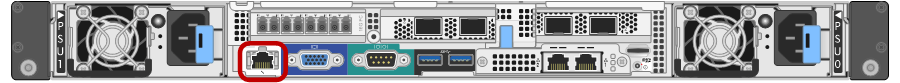
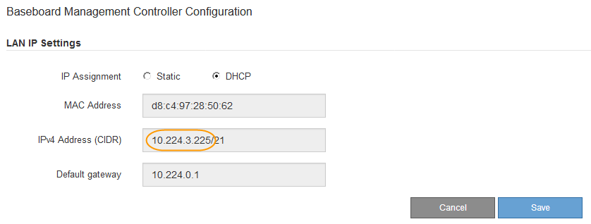

= Set IP address for BMC management port
:icons: font
:imagesdir: ../media/

[.lead]
Before you can access the BMC interface, you must configure the IP address for the BMC management port on the SG6000-CN controller.

.What you'll need

* The management client is using a xref:../admin/web-browser-requirements.adoc[supported web browser].
* You are using any management client that can connect to a StorageGRID network.
* The BMC management port is connected to the management network you plan to use.
+

.About this task

For support purposes, the BMC management port allows low-level hardware access.

IMPORTANT: You should only connect this port to a secure, trusted, internal management network. If no such network is available, leave the BMC port unconnected or blocked, unless a BMC connection is requested by technical support.

.Steps

. From the client, enter the URL for the StorageGRID Appliance Installer: +
`*https://_SG6000-CN_Controller_IP_:8443*`
+
For `SG6000-CN_Controller_IP`, use the IP address for the appliance on any StorageGRID network.
+
The StorageGRID Appliance Installer Home page appears.

. Select *Configure Hardware* > *BMC Configuration*.
+
image::../media/bmc_configuration_page.gif[screenshot showing Advanced > BMC Configuration option]
+
The Baseboard Management Controller Configuration page appears.

. Make a note of the IPv4 address that is automatically displayed.
+
DHCP is the default method for assigning an IP address to this port.
+
NOTE: It might take a few minutes for the DHCP values to appear.
+

. Optionally, set a static IP address for the BMC management port.
+
NOTE: You should either assign a static IP for the BMC management port or assign a permanent lease for the address on the DHCP server.

 .. Select *Static*.
 .. Enter the IPv4 address, using CIDR notation.
 .. Enter the default gateway.
+
image::../media/bmc_configuration_static_ip.gif[Baseboard Management Controller Configuration Static option]

 .. Click *Save*.
+
It might take a few minutes for your changes to be applied.
